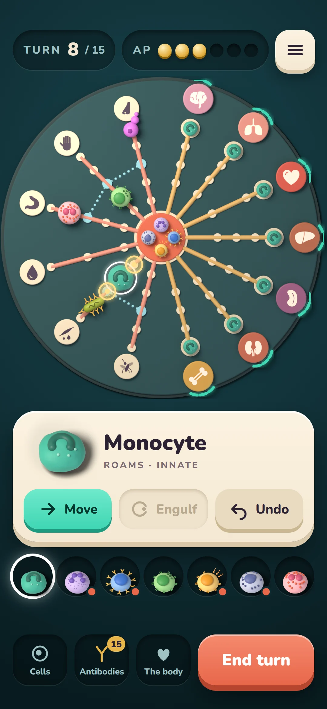
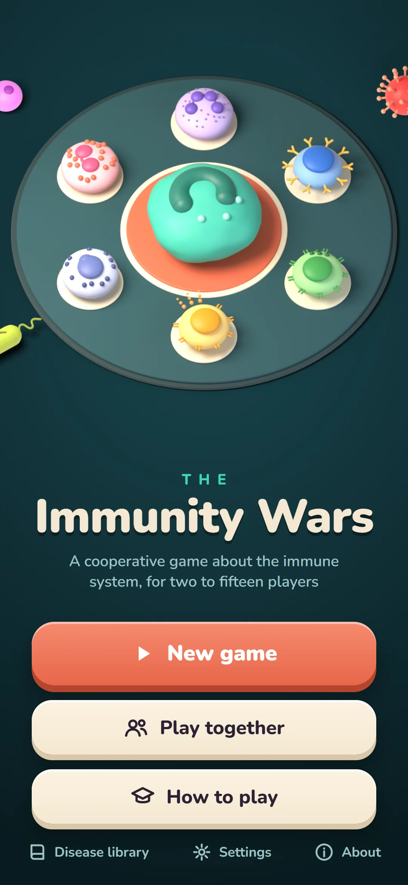
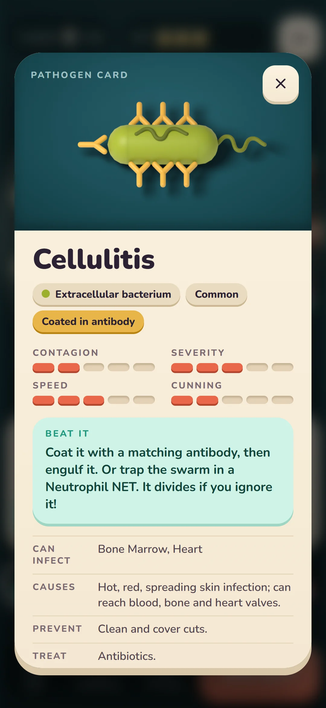

# The look: a plan for the redesign before Phase 4

**Status: RULED by Shantanu, 1 October 2026**, every item in §10. It answers his direction of the
same day: disregard low-end phones, give the game the look of the best modern mobile games before
Phase 4, rename Training to Easy, and add a guided game that teaches by playing. **This is Phase 2
resumed**, and the spec its stages are built to ([`PHASE2_BRIEF.md`](PHASE2_BRIEF.md) v2.2).

**Stages L1 to L4 are done, all on 1 October 2026:** he picked the Clay direction (§11), ruled the
board is drawn as pictures on the page (§12), approved the kit (§13), and played the play screen,
which holds 60 frames a second on his S25 (§14). **He ruled it deployed that night, as a mix of two
looks, with his review of the whole the next day** (§14, the last heading). **L5, the other screens,
is built for that review and not yet ruled on** (§15); **it was deployed on 2 October, with Easy**
(§19). **L6 is under way:** Easy is done (§16), and the guided game is ruled to script everything,
its seven turns ruled as listed, and built: the engine's part, the lesson, and the light that leads
the player, and what changes between the difficulties (§18, §19). The hints and the coach are
removed. What it wants now is his review. **The newcomer test is deferred indefinitely, by
ruling** (§24): deferred, not met.

## 1. What is decided already

| # | Ruling (Shantanu, 1 October 2026) |
|---|---|
| 1 | **Modern phones only, and no floor phone: the Samsung Galaxy S25 is the one device measured** (*"Actually no floor phone, we use only the s25"*). The ₹6–8k handset is no longer the bar |
| 2 | **No money is spent.** All art, sound and motion is generated or written here. Free tools may be plugged in |
| 3 | **A low-graphics setting comes later**, for the classroom edition |
| 4 | **Shantanu decides the look.** Kartik's part stays the rules and the science |
| 5 | **Training is renamed Easy**, and a **guided game** replaces reading How to play |

## 2. The recommendation: keep the codebase, replace the screens

**Not React Native, and not a game engine.**

- React Native draws native buttons and lists. A game's look is custom-drawn art, motion, effects
  and sound, which it does not give.
- Unity or Godot would mean porting the rules engine, and losing the proof that it plays as Kartik's
  original does.
- So: **one TypeScript codebase, Capacitor for Android and iOS, and a new screens layer.**

| Kept, untouched | Kept, re-skinned | Replaced |
|---|---|---|
| The rules engine, content, protocol, room, relay | What is offered and to whom, effects, the table, every string in the catalogue | Every screen's drawing, the board renderer, all 89 art files |
| Their tests, the corpus, the controls | Their tests | The Gate 1 audit is re-aimed at the new screens |

## 3. What "the look" means here, from the references

His references were Monument Valley, Alto's Odyssey, Threes, and the digital editions of Wingspan,
Root, Ticket to Ride and Through the Ages. What they share, turned into rules for this game:

1. **Few words on the board.** Shape, colour and motion carry the state; text is for the card you
   open, not the surface you play on.
2. **Every tap answers.** A move, a kill, a coat, a refusal each has its own motion, sound and
   haptic, in under a tenth of a second.
3. **The camera does the explaining.** Wide for planning; it moves in on the action being taken and
   on each beat of the spread.
4. **Press and hold to read anything.** A pathogen, a cell, an organ: a full card, the way a player
   leans in at a table.
5. **Each player's screen is theirs.** In a game together, a player's own pieces lead; the rest is
   quiet. Root's digital edition is the model.
6. **Legal moves glow; illegal ones are not offered.** Already the rule here; the new look makes it
   beautiful.
7. **Undo is always one tap away.** Already built.

## 4. Where the art comes from, with no money spent

In order of preference, because each step down adds a licence question:

1. **Written in code:** vector shapes, gradients, lighting and particle effects. Ours outright, sharp
   at any size, tiny to ship. The Monument Valley and Alto's look is exactly this kind of art.
2. **Modelled and rendered in Blender** (free): the seven cells and the pathogens as soft, lit,
   living shapes, rendered to animated sprites. Ours outright. Needs Blender running on this PC with
   its connector switched on; Shantanu would be walked through that.
3. **Generated images**, only from a tool whose terms allow redistribution, checked and recorded in
   `ASSETS.md` before a single file ships.

**Sound** is synthesised in code. **Replacing all 89 current files** also retires the open question
about the present art's licence.

## 5. The technology, decided by measurement

The board moves from flat SVG to whichever of these wins on the S25:

- **(a) A GPU canvas for the board** (PixiJS), with menus and text staying ordinary page elements;
- **(b) The present SVG, with real motion added.**

A small prototype of each, playing one turn and one spread, measured for frame rate on the S25.
This project's rule is to simulate before building, and this is the decision most expensive to
reverse.

> ⚠️ *Amended 1 October 2026, by ruling (§12).* This section was written before the look was
> picked. Clay is made of 3D models, which adds a third way: **(c) the models themselves drawn live
> on the phone** (three.js). All three are prototyped and measured. "The present SVG" in (b) is,
> for Clay, pictures on the page moved with CSS.

## 6. The guided game, and Easy

**The guided game.** Three to five minutes, scripted: an infection arrives, move a cell, engulf it,
make antibodies and coat a bacterium, end the turn and watch the spread, win. One thing is lit at a
time, with an arrow; everything else is dimmed and cannot be tapped.

- It needs **the engine to accept a fixed script of dice and cards**, which it cannot today. That
  is an engine change, made and proven the way the queue's were.
- The script is content; the spotlight is one component.
- It **replaces the present hints and coach**, and it is what the newcomer test is run on.
- How to play, the long text, stays as the reference library.

**Easy.** The word changes on the screens, in the engine's own messages, and in the printed rulebook,
quick reference and study packet, in one change, so the table and the app keep agreeing.

## 7. The stages, and what Shantanu sees at each

| Stage | What is made | The gate |
|---|---|---|
| **L1 Style frames** | Two or three directions, each as one finished picture of the play screen, the title and a card | **He picks one.** No code before this. ✅ *Done, 1 October 2026: Clay (§11)* |
| **L2 The moving prototype** | The chosen frame playing one turn and one spread, all three ways (§5, §12), on the S25 | Frame rates read; the board's technology ruled. ✅ *Done, 1 October 2026: measured on the S25, and ruled pictures on the page (§12)* |
| **L3 The kit** | Colour, type, motion and sound rules; buttons, cards, sheets; the full set of pieces | He approves the kit. ✅ *Done, 1 October 2026: built in three parts and approved on his phone (§13)* |
| **L4 The play screen** | Board, pieces, actions, the spread, the log, the camera | Played on his phone. ✅ *Done, 1 October 2026: built in five parts, played on his phone, the audit re-aimed and clean, and measured on the S25 at 60 frames a second (§14). Ruled deployed that night, as a mix of two looks* |
| **L5 Every other screen** | Title, difficulty, playing together, planning, result, the library | Played through, alone and together. *Built on the night of 1 October for his review the next day, without a proposal round, on his word; every choice in it is his to overrule (§15)* |
| **L6 The guided game and Easy** | The scripted game; the rename; the printed texts | A newcomer plays it unaided. *Easy is done, 2 October 2026, ruled "Now" (§16). The guided game is ruled to script everything (§18); its seven turns are ruled as listed, and the engine's part, the lesson and the light that leads the player are built (§19); and so are the difficulties' explanations. **The newcomer test, this stage's gate, is deferred indefinitely by ruling (§24): deferred, not met*** |
| **L7 Finish** | Polish, the audit re-aimed, the newcomer test (*deferred indefinitely, §24*), the measurement on the S25 | **Gate 2: his visual approval** |

Then Phase 4 (Android), Phase 5 (iOS), Phase 6 (the classroom edition, with the low-graphics setting
and Hindi).

## 8. What this does to what was owed

| Owed from Phase 2 | Becomes |
|---|---|
| The handset performance pass | Measured on the S25, at L2 and again at L7. It still settles the app shell, Capacitor against React Native, before Phase 4 |
| The newcomer test | Run on the guided game, at L6. *Deferred indefinitely by ruling, 2 October 2026 (§24): deferred, not met* |
| Gate 2 | The approval at L7 |
| The shorter How to play | Superseded by the guided game |

## 9. What could go wrong, said plainly

- **The art is the risk, not the code.** Studios have artists. Generated and code-written art can
  reach a clean, minimal look like the references; it will not reach a hand-painted one. L1 exists
  so this is seen as pictures before anything is built on it.
- **A canvas board is invisible to the accessibility audit**, which reads page elements. If (a) wins,
  the board needs a parallel description for the audit and for screen readers.
- **Dropping the cheap phone narrows who can play** until the low-graphics setting exists. With the
  S25 the only device measured, how it runs on anything slower is unknown, and is not claimed.
- **It is large.** The present screens took five weeks; this replaces all of them.

## 10. Ruled, 1 October 2026

1. **The floor phone:** none. *"Actually no floor phone, we use only the s25."*
2. **This order of stages**, with nothing built before he picks a style frame: *"Yes."*
3. **The accessibility gates** (touch targets, contrast, text that scales to 200%, playing offline)
   are kept as they are: *"Yes."*
4. **Portrait only**, as now: *"Yes."*
5. **Blender** is installed, with its connector; he starts it when a stage needs it.
6. **Bookkeeping:** this is Phase 2 resumed, under a new version of its brief: *"Yes."*

## 11. L1, ruled 1 October 2026: Clay

Three directions were drawn, each as the play screen, the title and a card, at 1080 × 2340, the
S25's own screen:

| | Direction | How it was made |
|---|---|---|
| A | Daylight: light, flat and calm | Drawn in code |
| B | Under the lens: dark and luminous, like fluorescence microscopy | Drawn in code |
| **C** | **Clay: soft 3D pieces on a board that looks like an object** | **Modelled and rendered in Blender** |

**Shantanu picked C:** *"I love c, the clay look."* Claude had recommended B; the look is his to
decide (§1, ruling 4), and this is that decision.

| The play screen | The title | A card |
|---|---|---|
|  |  |  |

**What the pictures are.** All three directions showed one position from a recorded Easy game: turn
8 of 15, 3 of 6 Action Points left, the Monocyte selected, and its two legal moves taken from the
engine's own move query rather than drawn by hand. Every word on them comes from the content pack.
The board's positions were read from `packages/content/src/board/geometry.json`.

**What Clay commits to.**

- The seven cells, the pathogens and the board are 3D models: a soft flattened body, with the
  nucleus, granules and receptors laid on top so that the features that tell the cells apart read
  from above. Each drawing makes a claim a scientist can check: the monocyte's one kidney-shaped
  nucleus, the neutrophil's lobes joined by strands, the eosinophil's two lobes and large granules,
  the B cell's antibody receptors with stems in the membrane and arms outward, and a coated microbe's
  antibodies the other way round, arms on the microbe and stems outward.
- Deep teal for the table and the board, cream for the controls, coral for the bloodstream and the
  main button, mint for what is healthy or allowed, gold for Action Points and antibodies.
- Controls that look pressed out of the same material: thick, rounded, with a visible edge.
- No money spent: Blender is free, the models are ours outright, and the typeface is the Nunito the
  app already ships under the Open Font License.

**What the pictures do not settle, carried forward.**

1. **How clay moves.** §5 was written before the pick and names two ways to draw the board. A look
   made of 3D models has a third, drawing the models live. Which of them L2 measures is not ruled.
2. **The bacterium is one generic rod**, as in the present art. Cellulitis, the disease on the card,
   is caused by round bacteria. A piece shaped to each disease needs a shape recorded in the content
   pack, and that is Kartik's decision.
3. **The accessibility gates were not measured on pictures.** Some labels are drawn smaller than text
   scaled to 200% allows. The kit (L3) and the play screen (L4) are where they are held to the gates.
4. **The typeface** is the one already shipped. Choosing one belongs to the kit.
5. **The pictures are not app code.** Nothing under `packages/` changed for them.

## 12. L2, ruled 1 October 2026: the board is pictures on the page

**Three rulings, Shantanu, 1 October 2026**, on the proposal that followed the pick:

1. **All three ways are prototyped**, and their practical pros and cons are to rest on real data
   where that is possible: *"Yes we need to prototype all 3. And we need to understand the
   practical pros and cons of each based on real data where possible."*
2. **The pass line**, set before any number existed: no frame slower than 16.7 ms through the turn
   and the spread; a tap answered within 100 ms; the board drawn within 1 second; all pictures and
   models under 10 MB. **It is not a hard rule:** *"Yes but let's not make it a very hard rule,
   things are that marginally over can still be considered etc. basically evaluate before rejecting
   to see if it can be made to work."*
3. **The prototype is committed**, as `tools/look-prototype/`, with PixiJS and three.js as its own
   dependencies and nowhere else, and it is measured on the S25 with the built page served on the
   home network, as the phone checks were before the app was served from the server: *"Agree. They
   way we used to do before deploying on the server."*

**What is built.** `tools/look-prototype/` (*removed on 1 October 2026 once the play screen was
measured in its place, §14; it is in the repository's history, last at commit `da7ad3f`*): the Clay play
screen playing a calm turn and a crowded board, both recorded from the real engine, drawn as
pictures on the page, as pictures on a GPU canvas, and as the models drawn live. One motion, decided
once, is handed to all three. A frame timer and a tap timer measure them, and each timer was made to
fail on purpose before it was trusted.

**What is measured.** [`LOOK_L2_MEASUREMENT.md`](LOOK_L2_MEASUREMENT.md). **On the S25, 1 October
2026, run by Shantanu: all three ways hold 60 frames a second**, on the calm turn and on the crowded
board. Two rows have one missed refresh each in 1,685 frames, which does not separate the ways.
What does separate them:

| | The page's own work per frame, crowded board | First draw | Sent to the phone |
|---|---|---|---|
| Pictures on the page | 2.6 ms | 109 ms | 287 KB |
| Pictures on a GPU canvas | 0.6 ms | 413 ms | 433 KB |
| Models drawn live | 4.6 ms | 784 ms | 849 KB |

The phone ran the page at 60 frames a second, not the 120 its screen can show, so 120 is not
measured. Taps were not timed on the phone, and the ways were not watched side by side; his reading
from the measured run is that the three look much the same and that the choice should go to what
performs best.

### L2 ruled and closed, 1 October 2026

Asked three things after the phone's numbers, Shantanu ruled: *"1. Page 2. Accept 60 3. Waive it"*.

1. **The board is drawn as pictures on the page.** Blender renders each piece and the board; the
   app moves them as page elements. Claude had recommended it, for being the lightest and the
   fastest to load, for adding no library, and for keeping every piece an element the
   accessibility checks and the audit can read. **No GPU canvas and no live 3D are added.** If an
   effect built at L4 cannot hold the frame rate this way, a canvas for that effect alone is a new
   proposal, measured then; it is not part of this ruling.
2. **60 frames a second is the target.** The phone ran the prototype at 60 and the line was ruled at
   16.7 ms. **120 frames a second is unmeasured, and nothing is claimed about it.**
3. **The tap test on the phone is waived: waived, not met.** The 100 ms line for a tap was never
   read on the S25. What the frame times allow, and what the PC measured, is an answer within about
   50 ms; that is an inference.

**Locked decision #1, Capacitor against React Native.** On this measurement Capacitor holds: the
look is reached with web technology at 60 frames a second on the S25. The plan measures again at L7
(§8), on the finished screens and in the app's own shell, which this measurement did not use; the
decision is confirmed there, before Phase 4.

**What this does to §9's warning.** "A canvas board is invisible to the accessibility audit" no
longer applies: there is no canvas board.

**What happens to the prototype.** It stays as the instrument its record was taken with, until the
play screen is built at L4 and measured in its place; then it is removed, and `pixi.js` and `three`
go with it. Neither is used by anything else, and neither is to be.

**What the prototype is not.** It is a measuring instrument. Nothing under `packages/` imports it
or changed for it, and it is removed when the ruling has been built into the app.

## 13. L3, the kit: ruled 1 October 2026

**The proposal's five points, all ruled as recommended:** *"Agree with all your recommendations.
Please proceed."*

1. **The piece set and its three rules.** Shape says what kind of thing it is. Colour says its
   antigen class, which is what an antibody has to match; the six class colours are the content
   pack's own. Soft and rounded is alive, hard-edged is not: only the toxin and the venom have hard
   edges.
2. **Your own cells stand on a base, and an invader never does**, so that colour never has to tell
   friend from foe. With seven cells and six classes on one colour wheel it cannot: the Monocyte and
   an intracellular bacterium are both teal.
3. **One shape per kind of pathogen.** The bacterium is a rod, though some of its diseases are caused
   by round bacteria; the parasite is a trypanosome, though its six diseases include an amoeba and a
   mite; the worm is a roundworm, though its seven include a tapeworm and a fluke. A shape per
   disease would need one recorded for each of the 97 diseases in the content pack, and is Kartik's
   to decide.
4. **The typeface stays Nunito. Sound is on by default, with a mute in Settings.**
5. **He approves the kit on a kit page on his phone**, built as three pull requests in this order:
   the pieces; then colours, type, buttons, cards and sheets, with the kit page; then motion, sound
   and haptics.

**Left for Kartik, and not part of the ruling:** the kind the content pack names "Hidden Virus"
includes two diseases caused by protozoa. The piece, one of your own cells with something showing
through it, is true of all thirteen; the name is his to keep or change.

### What the first measurement changed, before anything was built

The contrast gate ruled to be kept (§10, ruling 3) asks 3:1 of a meaningful picture against what it
is seen on. Measured from the renders on 1 October, before the gate was written:

| What was measured | Found | What it changed |
|---|---|---|
| Each cell against a plain cream base | 1.7 to 2.8: **every one fails** | The base is a **cream rim round a dark well**. Cells against the well: 5.05 to 8.06 |
| Each piece against the board of the L1 frame | The virus 2.6, the Monocyte 2.8, the fungus 2.9, the B-Cell 2.9: **four fail** | **The board is darker.** Invaders against it: 3.32 to 6.39 |
| A piece on the coral bloodstream | The virus 1.0, the bacterium 1.2: **unreadable** | **The bloodstream is a coral rim round a dark dish**, the same well as the bases. Invaders against it: 4.61 to 8.88 |
| The malaria piece's red blood cell | 3.08 against the darker board: passing with nothing to spare | A lighter red: 3.44 |

So ruling 2 is built as a rimmed base, not a plain disc, and the board and the bloodstream of the
play screen (L4) are darker than in the picture picked at L1. The board keeps its teal: it came out
grey at first, from the lamps' reflection on a dark surface, and is nearly matt now.

### Built: the pieces (the first of the three pull requests)

- **`tools/art-pipeline/clay/pieces.py`** builds all 24 pieces in Blender, with the base and a
  swatch of the board, and renders each in two views: the board view, from straight above under the
  board's own lamps, and the card view, at an angle. Its header says what each shape claims.
- **`tools/art-pipeline/clay.ts`** (`pnpm art:clay`) takes the renders in, holds every picture to
  the gate, and writes 49 pictures as 147 WebP files (0.96 MB) with a manifest that records what was
  measured. The grounds are measured from renders too: the board reads `#1c484d` once lit, the
  well `#193033`, the rim `#fde7c5`.
- **`pnpm art:clay:check` runs on every `pnpm verify` and in CI.** It re-measures every committed
  render, holds it to the gate, and requires the manifest and the output to be what the renders
  produce. It encodes nothing, so it takes seconds and answers the same on any machine.
- **Controls, each fired.** A piece the colour of the board is rejected and a cream one accepted; a
  set with no board swatch is refused, never passed for want of a ground. With the bound raised to
  4:1 the real set fails, which shows the gate reads the pictures. A ratio edited in the manifest,
  and an output file that is not the recorded one, each turn the check red.
- **The output's home was `tools/art-pipeline/clay/built/` for that pull request.** It moved under
  the app with the kit page, below.

### Built: colours, type, components and the kit page (the second of the three)

- **The kit**, in `packages/ui/src/kit/`: the named values (`tokens.ts`), the colour pairings and
  the bound each is held to (`contrast.ts`), and the components: the button in its three kinds, the
  card, the sheet, the pill, the chip, Action Point pips, the meter, a wrapping row of controls, the
  piece, and the pathogen's card. It has its own entry, `@immunity-wars/ui/kit`, so only the kit
  page pulls it in; every word a component shows is the caller's, from the catalogue.
- **The kit page**, `/kit.html`: every part as the real component, for him to look at on his phone.
- **The Clay art is served and is not a player's download.** It lives in
  `packages/app/public/art/clay/`, and the app's build keeps it and the kit page out of what the
  service worker stores on a phone, until a screen uses them at L4. Measured on the build: 194
  entries stored, none of them the kit's; 147 Clay pictures served.

**What measuring changed, again before it was built on.**

| Measured | Found | Changed |
|---|---|---|
| The kit's 23 colour pairings | Two failed: the go button's edge on a card (2.89) and a resting button's edge on a card (1.60) | Both edges darker: 4.00 and 3.55. A resting button is now marked by its edge and not only by its word |
| White words on the coral button | 3.25: under 4.5 | The main button's word is dark ink on coral: 4.68 |
| The quiet text of the L1 frame on cream | 4.16: under 4.5 | A darker quiet ink: 5.80 |
| The kit page with every word at 200% | The page grew wider than the phone: three buttons in a row, the card's four measures, and the grids of named pieces did not fit | Rows of controls wrap; the measures and the grids reflow; long display words may break. At 200% the page is 360 px wide and nothing is wider |
| A piece on a cream card | A faint box round it: the render's shadow reached the picture's edge (up to 48 of 255 there) | The pipeline feathers the edge, and the gate refuses a picture with more than 3 of 255 at its edge. Now 0 |

**Controls added, each fired:** `kit-contrast-reads-the-tokens` (a pale quiet ink fails by name),
`clay-kit-colour-is-measured` (the kit's board colour edited by hand fails), `clay-not-in-the-worker`
(the exclusion removed, the build test fails naming what the worker stores), and in the gate's own
set, a picture cut off at its edge rejected for its edge. Two of these checks were wrong on their
first run and said so: the edge control was refused for having nothing solid in it, which showed
nothing about edges, and the worker test read 0 entries from a list written in a spelling it did not
know, which its own "the list was read" line caught.

### Built: motion, sound and touch (the third of the three)

- **Motion**, `packages/ui/src/kit/motion.ts`: eight named motions (a move, an arrival, a
  departure, an engulf, a coat, a refusal, damage, a press), each written as data, a list of
  keyframes with a length and a curve taken from the kit's named values, and played by the
  browser's own animation engine.
- **A move is played from the new place.** The screen draws the piece where the game now says it
  is, then plays the hop from where it was. So a motion that ends, is cut short, or is never played
  leaves the piece where it belongs.
- **Less motion.** On a phone that asks for it, nothing travels, swells or shakes: an arrival or a
  departure fades, and anything else blinks once where it is.
- **Sound**, `packages/ui/src/kit/sound.ts`: ten sounds (tap, move, engulf, coat, arrive, damage,
  refuse, end of turn, win, loss), each a short list of notes made by the browser's audio engine.
  **There is no sound file**, so nothing was bought, downloaded or generated, and there is nothing
  to license. On by default, as ruled; one mute silences sound and buzz together. The Settings
  screen that holds the mute is L5's.
- **Touch.** Seven of the ten also ask the phone for a short buzz, where a web page is allowed to.
  That is Android's browser; an iPhone's browser has no such thing, and the fuller version waits for
  the app's own shell at Phase 4.
- **Every kit button answers** with the tap sound and a buzz, through the one shared audio, unless
  it names a sound of its own.
- **On the kit page:** a Motion section (a cell that hops, engulfs and refuses; a bacterium that
  arrives and is coated; an organ that takes damage; a switch that shows the less-motion version)
  and a Sound and touch section (the ten sounds, and the mute).

**What was measured, and what was not.**

| Measured, in a headless phone-sized browser on the PC, pressing each button | Found |
|---|---|
| Each of the six motion buttons | Starts its own motion (260 to 550 ms), one or two voices in the audio engine, and its own buzz request; the arrival has no buzz, by design |
| The same six with less motion | Only fades and blinks of 180 ms; no transform is animated at all |
| The cell after a hop, and after a second | Drawn at 98 px, then back at 14 px: where the page put it, not where a motion left it |
| The ten sound buttons | 1 to 4 voices each, as the list says; the audio engine running after the first press |
| Muted | No voice and no buzz request; the motions still play |
| The page with every word at 200% | 377 px at first: one sound button's length label spilled 17 px past the phone's edge. The length now sits under the word, and the page is 360 px wide with nothing wider |

- **Not measured: how any of it sounds or feels.** A headless browser has no ears and no motor. That
  a sound was started is known; whether it is the right sound for an engulf is his to judge, on the
  phone.
- **Not measured: frame rate.** These are the same kind of motion as stage L2 measured (page
  elements moved by transform and opacity), but the kit page was not itself timed. The play screen
  is, at L4.
- **A design rule taken on general grounds, not from the S25:** a phone's small speaker plays little
  of a low note, so every sound has a note starting at 250 Hz or above. The first drafts of three of
  them (arrive, damage, refuse) sat wholly lower and were raised before anything was heard.

**Checks and their controls, each fired.** The kit's tests hold every motion to changing only
transform, opacity and filter, to not travelling when less motion is asked for, and to 600 ms; and
every sound to a note a phone plays, to notes that never add up past full loudness, and to the
mute. `kit-motion-less-motion-is-still` (the less-motion branch switched off: the test fails naming
the move) and `kit-sound-mute-is-obeyed` (the mute no longer read: the test fails saying a muted kit
made a sound). **The check on the page was itself wrong on its first run:** it pressed the first
button called Move, which is the one in the Controls section, and reported a move with no motion.
Its own list of what each press started is what showed it.

**Not held by a standing check:** that a kit button's press reaches the audio. The package has no
way to press a button in a test; it was seen once, in the headless run above.

### The kit approved, 1 October 2026

Shantanu opened the kit page on his S25, with all three parts on it, and ruled: *"Tested. It's
perfect. Please proceed."*

- **That is the gate of stage L3**, and it is his judgement of what no check here could make: how
  the pieces, the controls, the motions and the sounds look, sound and feel on the phone.
- **Asked for no change.** The kit goes to the play screen as it stands, the measured changes above
  included: the darker board, the rimmed bases, the dark word on the coral button.
- **What the approval is not.** It is of the kit, on the kit page. The screens built from it are
  judged at their own stages, and Gate 2, his approval of the whole look, is still L7's.
- What he pressed and for how long is not recorded; only his words are.

## 14. L4, the play screen: ruled 1 October 2026

**The proposal's five points.** Each was put with a recommendation, and Shantanu answered:
*"Agree with the steps please proceeed"*. It is read as agreement to all five, and he was told it
was read so.

1. **Built in place; the server keeps today's app.** The present screen's drawing is replaced piece
   by piece, so there is one play screen and one set of tests throughout. From the first merge of
   L4 until the other screens are done at L5, `main` is a mix of two looks and **is not deployed**.
   A fix to the live app in that time is made from the commit that is deployed.
2. **The hints and the first-game coach are switched off from L4, not redrawn.** The guided game
   replaces them at L6. So the new look does not reach the server before L6.
3. **No words on the board.** Organ and route names and step numbers leave it; each name is its
   picture's label and is said on its card.
4. **The board, the organs and the ways in are new art**, shown on the kit page before the play
   screen depends on them.
5. **Five pull requests in this order**, one at a time, each played on his phone: the board,
   standing still; the frame and the panels; motion and sound; the camera; measured on the S25 and
   tidied.

### Built: the board, standing still (the first of the five)

**The art**, made in Blender and held to the same gate as the pieces.

- `tools/art-pipeline/clay/board.py` renders the board itself: its routes, branches, steps, lymph
  nodes and bloodstream, each where `geometry.json` says, and nothing that moves.
- `clay/pieces.py` gains a coin for each of the seven organs and the six ways in, and the piece for
  a pathogen new to the body: a pale lump with a question mark, wearing none of the six class
  colours, because its antigen matches none of them. It also stands for anything the game is hiding.
- The pictograms on the coins moved into the pipeline (`clay/pictograms.ts`), since the prototype
  that drew them is removed at the end of L4.
- 65 pictures as 195 files, 1.4 MB, of which the board draws 42.

**What the gate holds, added here.** Controls for each were fired.

| What | Held to 3:1 | Measured |
|---|---|---|
| An organ's coin | Its cream pictogram against the coin's own face | 3.61 to 4.60 |
| A way in's coin | Its dark pictogram against the coin; the coin against the board | 6.59 to 7.04; 8.5 |
| The unknown piece | As an invader; and its question mark against its body | 5.89 and 8.19; 5.80 |
| The board's routes | The faintest of them against the board's own ground | 4.44 |
| Its branches, steps, lymph nodes | The same | 5.31, 7.51, 6.75 |
| The bloodstream's rim | The same | 3.46 |
| The board's ground | Against the swatch the pieces were measured on, within 1.15:1 | `#1a4549` and `#1c484d` |

The pictogram is found in the finished render with its own shape, laid where Blender laid it. A
shape in the wrong place mixes the two colours and reads lower, so it cannot pass a coin that
should fail.

**What measuring changed, before it was built on.**

| Measured | Found | Changed |
|---|---|---|
| A cream pictogram on the organ coins of the L1 picture | A coin cannot be both 3:1 against the dark board and 3:1 under a cream pictogram, except in a sliver. The lungs read 3.15 and the marrow 3.16 | What must be read is the pictogram: it is held against its coin and against the board. The lungs and the marrow are darker: 3.73 and 3.77 |
| The board's steps | 5.33, the colour of a lane: each lane ran over its steps, so a step was a dot with a line through it | The steps stand taller than a lane is thick: 7.51 |
| A number on a piece in the bloodstream | Laid over the cell, the number was larger than the cell | A number hangs on a piece's edge; for a cell in the bloodstream, outward, on the rim |
| What the phone stores to play offline | The proposal said about 1.2 MB, from the build tool's own line. That line leaves the art out. Measured from the files it was 1.62 MB | With the board's 42 pictures it is 2.14 MB |

**The board on the page**, `packages/ui/src/board/ClayBoard.tsx`, in place of the SVG board.

- **It decides nothing.** What stands where, what a tap means and what is offered are the same
  working parts as before; the old drawing was cut out of `Board.tsx`, which keeps the model.
- **One piece is one kind in one class.** A piece's colour says its antigen class, so one piece
  cannot stand for an enveloped virus and a naked one. Two classes of a kind on a step are two
  pieces, each with its own count. Before, a step's invaders were gathered by kind alone.
- **No words on it.** Numbers only: how many a piece stands for, and the turns until a spent cell
  is back.
- **An organ's health is an arc of segments.** One it has is thick and coloured; one it has lost is
  a thin pale line. The count is carried by shape, and the colour repeats it.
- **The bloodstream is still a zone:** what invades is gathered at its centre, your cells ring it.
- **A legal move glows gold, a hop along the lymph blue, an attack is ringed in coral.**
- **The bloodstream is drawn 53 units across its rim; the print's is 50.3.** Every position is the
  content pack's; only the dish's drawn size differs, as in the picture he picked.

**Seen, in a headless phone-sized browser on the PC:** a real game walked from the title to the
command stage: 43 pictures drawn, none broken; 7 cells, 7 residents, 7 organs, 6 ways in; 13 legal
moves for the Monocyte. On the kit page, real taps by position: a tap on a cell rings it, a tap
12 px off it still does, a tap on bare board clears it. At 200% text the page is 360 px wide.

**The hints and the coach are off**, as ruled, in the app's shell. **Switching them off found a
false note.** The play screen's own comment said that leaving two inputs out turned hints off. It
did not: every hint still showed. The walk's list of buttons had a hint's button in it after the
switch, and that is what said so. The play screen now does what its comment says.

**A masked pathogen's name no longer reaches the page.** The hook the drivers find an invader by
carried the first six letters of its disease, "Pathog" for one the game was hiding. Nothing showed
it, and anyone who looked could read it. It carries the kind now.

**Controls added, each fired:** `clay-page-and-blender-agree`, `clay-every-disease-has-a-picture`,
`clay-no-words-on-the-board`, `clay-board-art-in-the-worker`,
`clay-board-read-where-geometry-says`; and in the gate's own set, a coin whose pictogram is its
face's colour, a board with nothing drawn on it, and a board that is not the pieces' ground. One
control was wrong on its first run: it asked that a blank coin fail for one reason only, and a blank
coin fails for two.

**Not done here, and known.**

- **The bloodstream is crowded.** Seven cells in it are each about 11 px across on the phone. That
  is the size the old board drew them at, and it is small. The camera, the fourth pull request, is
  what moves in on it.
- **The organs still fly in from the old planning picture.** At "Command your cells" the old organ
  icons travel to the board and land on the new coins. The planning screen is redrawn at L5.
- **The look is a mix:** the board is Clay, and everything round it is not yet.
- **Not measured:** the frame rate, and anything on the S25. Both are the fifth pull request's.
- **The accessibility audit was not run.** It walks the old screens, and is aimed at the new one in
  the fifth pull request.

### Built: the frame (the second of the five, its first half)

**The frame of the play screen is drawn from the kit**, `packages/ui/src/play/Frame.tsx`, on the
table's dark ground out to the screen's edges. What each part is given, and the hooks the drivers
and the audit find it by, are as they were.

- **Top:** the turn; the Action Points as gold pips, as many lit as are left; what is in force, as a
  chip; the messages and the menu as cream buttons.
- **The selected piece's card:** its picture on its base, its name (which opens its card), Undo, and
  its actions two abreast. **Mint is what the piece can do now. Flat and grey is what it cannot, and
  a press on it says why. Cream is everything else.**
- **Bottom, in one row, as in the picture he picked:** the three views' tiles, each a picture over
  its word, and beside them the stage's one coral button.
- **The spread's line** is said straight onto the table, with a die that hit in coral.

**What is not redrawn yet stands on a sheet of the old paper:** the Cells, Antibodies and Body
views, a tapped step, the Action Points' terms, what is in force in full, the new cards and
planning. Its words keep the contrast they were measured at. Each sheet goes as its view is redrawn:
the views in the second half of this pull request, the new cards and planning at L5.

**The one close has a second place to be drawn.** With the tiles and the button in one row, the
close that floats across the bottom of the screen covered the tiles, so a view could not be changed
without closing first. A view opened in the middle now has its close drawn where the stage's one
button was: the same close, with the same word and hook, beside the tiles. What is drawn over the
whole screen (a card, the messages) still has the floating one. `nav/stack.ts` says which.

**Measured, in a headless browser on the PC at the S25 tab's size, 360 by 641.**

| Measured | Found | Changed |
|---|---|---|
| The room left for the middle | 162 px, and the card with one row of actions needs 162. With the tiles in a row of their own it was 100 | The one row is kept. Two rows of actions scroll |
| "Tap to continue", beside the tiles | Two lines, and a taller row | The tiles are not drawn while a spread plays; they could not be pressed then |
| The middle with the text at 200% | 25 px of a screen: the bars above and below had grown round it | The board gives way before the middle does. The middle has 160 px; the page is still one screen tall and no wider than the phone |
| Controls under 44 px, at rest and at 200% | None | |
| The screen left alone for two seconds, at each of seven stages | No layout and no style work at any of them; 1 ms of script in all | |

**Not measured:** the frame rate, and anything on the S25.

**The kit's button carries more:** the hooks and labels a screen's control needs, and a way to be
drawn unavailable and still take a press. **Controls added, each fired:**
`frame-flat-action-still-answers` (the frame's actions made unavailable the kit's plain way: the
test fails saying a flat action cannot be pressed) and `frame-pips-show-what-is-left` (every pip
lit: it fails naming the count).

**The scripts that walk the game hung for minutes at their last line.** It was the browser being
closed, with everything already measured and written; the page itself was idle. They now end
without waiting for it.

### Built: the panels (the second of the five, its second half)

**Everything the play screen opens is drawn from the kit.**

- **In the middle, each on a card:** the Cells, Antibodies and Body views, a tapped step, the Action
  Points' terms, what is in force, and a row's several targets.
- **Over the whole screen:** the pathogen's card and the cell's card, the messages and the table,
  the dialogs, the menu, and the floating close.
- **A piece is its Clay picture everywhere:** on its base in the Cells view and on a tapped step,
  and at an angle at the head of its card, in the colour of its antigen class.
- **Each antibody class's chip carries a dot of that class's own colour,** the content pack's,
  which is the colour the pieces of that class wear on the board. An antibody matches a class; the
  dot is how the two are seen to belong together.
- **One of several is chosen by shape as well as colour:** pressed in and ringed.

**Still on the old paper, for L5:** the new cards and planning. **Not redrawn, and not on the old
paper:** the notices for a lost connection and a save that failed, which have their own grounds and
read as they did; the hints and the coach, which are off.

**A redrawn file may name no colour of its own.** The kit's colours are few and named, and every
pairing of them that carries words or marks a control is measured, 45 pairings now. A colour written
straight into a screen is outside that. `play/clayColours.test.ts` reads the 20 redrawn files with
their comments taken out and fails on the first `#rrggbb` it finds, naming the file and the colour.
The one exception is the old paper's own two colours, written where that sheet is, and it goes at L5.

**Measured, in a headless browser on the PC at 360 by 641.**

| Measured | Found |
|---|---|
| Seven views (cells, antibodies, the body, the Action Points' terms, the messages, the menu, a cell's card), each open, at rest and with the text at 200% | The page one screen tall and 360 px wide at all fourteen; nothing wider than the phone; no control under 44 px |
| What the phone stores to play offline, from the files | 2.69 MB in 311 files, up from 2.14: the pieces as a card shows them, at every size |
| Pictures on the cards, sheets and views walked | None broken |

**The check was wrong on its first run, and its own list said so.** It printed, beside each reading,
which view was open. At 200% the cell's card read as nothing open: the script had pressed the
selected cell a second time, which lets it go, so there was no card to measure. The reading was of
the bare screen and would have passed. It now presses the cell only when none is in hand.

**Not measured:** the frame rate, and anything on the S25. **Not run:** the accessibility audit.

**Control added, and fired:** `play-screen-colours-are-the-kits` (one old colour written into a
redrawn panel: the test fails naming the file and the colour).

**Found when the audit was run, and fixed on this branch: with no network the app came back as a
blank page.** The kit's components, now used by the play screen, were built into a script named
`kit-…js`, and the exclusion written at L3 to keep the kit page off a phone matched it by name. The
build test passed, because it forbade anything named `kit` and never required what the app needs.
The kit page's own script is now named `kitPage`, and the build test follows the app's page to every
script it needs and requires each one stored; control `app-scripts-in-the-worker` puts the old
exclusion back and sees it fail. [`FINDINGS.md`](FINDINGS.md) #109. It was never on `main`.

### Played on his phone, 1 October 2026: the board, the frame and the panels

Shantanu played the first two pull requests on his S25 and said: *"Plays very smooth, happy to
proceed for the moment, there are ux improvements to be done but I want to do thay later after this
is deployed on our online server."*

- **The first two are played**, as ruling 5 asks of each. This is not Gate 2, and he did not say it
  was.
- **There are improvements to how it is used that he has not named yet.** They are his to name, and
  he has put them after the look is on the server. Nothing was changed for them here.
- **"Smooth" is his eye on his phone, not a measurement.** The frame rate on the S25 is still the
  fifth pull request's to read.
- **When the look reaches the server is not changed by this.** Ruling 2 stands: not before L6,
  because the hints and the coach are off until the guided game replaces them.

### Built: motion and sound (the third of the five)

**The board plays what changed.** The engine hands over states, not events, so each time the board
is drawn the picture is compared with the one before, in `packages/ui/src/board/changes.ts`, and
what differs is named and played with the kit's motions.

| What changed | What the board plays | The sound |
|---|---|---|
| A piece went to another step | It hops there from where it was | move |
| A piece was only nudged aside to make room | It slides, and does not hop | none |
| A piece is new to the board | It arrives | arrive |
| A group multiplied where it stands | It swells, and settles | arrive |
| A pathogen is gone from a step one of your cells stands on | It shrinks into the cell, which swells | engulf |
| A pathogen is gone and no cell was on its step | It shrinks away | tap |
| The same invaders are now coated | The coated picture snaps on | coat |
| An organ lost health | Its coin flinches | hurt |

- **One sound for a picture.** A spread can change a dozen things at once, and a dozen sounds is a
  noise. The picture gets the sound of what matters most in it: an organ hurt, then a swallow, then
  a coat, then an arrival, then a step.
- **A piece is always drawn where the game says it is.** The motion is only how it got there. One
  cut short, or a phone that asks for less motion, leaves the board right; with less motion nothing
  travels at all.
- **The first picture a board is given plays nothing:** nothing has happened yet.
- **A tap on a piece or a step answers at once** with the tap. A tap on a legal move does not: what
  it did is heard when the board changes.
- **The game's last sound** is the win or the loss.
- **Who is who.** One of your cells keeps its name from picture to picture. A piece that stands for
  invaders does not: its name has its step in it, so a group that walks a step has a new name.
  Followed by name, it would be one piece fading out and another popping in. It is followed by the
  invaders it stands for.

**Two things added to the kit, which he has not seen there.** A ninth motion, a slide, for a piece
that is only making room; and a way to play one motion over another, so that a cell that swallows
while it slides to the middle of its step does both, and does not jump.

**The kit page's board can be changed,** one thing at a time, by buttons under it, so that each of
these can be seen and heard on the real board: the buttons only hand it a new position.

**Seen, in a headless browser on the PC.** It reads which motions the page started and which sound;
it has no ears and no eyes.

| Done | The board played | The sound started |
|---|---|---|
| In a game: the Monocyte moved out of the bloodstream | The Monocyte hopped (450 ms); the six cells left in the ring slid (320 ms) | move |
| In a game: the turn ended, in two runs | In one, a later beat of the spread moved a virus a step, and it hopped; in the other nothing on the board changed | the end of the turn; then move, in the run where the virus moved |
| On the kit page: the Monocyte engulfs a coated bacterium | The Monocyte swelled; the bacterium shrank into it and was then taken off the page | engulf |
| A coat, an arrival, an advance, a hurt organ | Each its own motion | coat, arrive, move, hurt |
| The same with less motion asked for | Only fades of 180 ms; nothing travelled | the same sounds |
| The play screen left alone for two seconds, at seven stages | No layout, no style work, no script | |

**The check was wrong on its first run, and its own list said so.** It pressed Engulf after moving
the Monocyte away, when there was nothing left to engulf, and the line read "played: nothing, sound:
none". The order was the check's mistake, not the board's.

**Not measured:** the frame rate while these play, which is the fifth pull request's, on the S25.
How any of it looks and sounds is his to judge.

**Known, and left.** A new arrival's sound is heard while the new cards cover the board, because
the board behind them is where it arrives. A kill from a distance has no sound of its own among the
ten, and uses the tap.

**Control added, and fired:** `board-motion-follows-the-invaders` (the comparison made by a
piece's name: the test fails saying a group that walked a step came out as an arrival and a leave).

### Built: the camera (the fourth of the five)

**There is no camera.** The board's own element is drawn larger and shifted, one transform, eased
over half a second. `packages/ui/src/board/camera.ts` is the arithmetic: given what just changed,
which part of the board should fill the play area.

| When | What it does |
|---|---|
| The player is choosing, and a piece only moved | Nothing. It stays wide |
| The player is choosing, and something was swallowed, coated, killed, or an organ was hurt | In, to 1.3 times, on where it happened. Wide again 0.9 s later |
| The spread is playing, and a beat changed something | In, to 1.8 times, on what changed. It follows each beat, and goes wide 1.3 s after the last |
| What changed is spread across the whole board | It stays wide |
| A finger touches the board | Wide at once |
| The phone asks for less motion | It never moves |

- **Why a plain move is left alone.** The plan's rule is that it moves in "on the action being
  taken". Moving a piece is the commonest thing a player does and needs no explaining; a board that
  leaned in after every step would never hold still. This is a reading of the rule, and his to
  overrule when he names what he wants changed.
- **It never shows what is not board.** The part shown is kept inside the picture, so moving in on
  an organ at the rim does not bring the empty table in from the side.
- **A tap is read where the board is drawn at that instant,** so a tap while it is in, or on its
  way back, still lands on what the finger touched.
- **In the bloodstream the pieces are 1.8 times larger while it is in:** about 20 px each where they
  were 11. That is the answer the proposal gave for the crowded bloodstream, and it applies only
  while the spread plays or just after an attack there.

**The board's picture, measured before a size was chosen,** as the proposal said it would be.

| The board's picture, as WebP | Size |
|---|---|
| 1,200 px across, what was drawn until now | 84 KB |
| 1,600 px | 121 KB |
| 2,000 px | 162 KB |
| 2,400 px | 214 KB |

At 1.8 times on a 360 px phone with three device px to one, the board is 1,944 px across. **2,000 px
is chosen:** one px of picture to one of screen at the furthest it goes in. The pieces' pictures
were already large enough. What the phone stores to play offline is 2.86 MB, up from 2.69.

**Seen, in a headless browser on the PC.**

| Done | The camera |
|---|---|
| On the kit page: a plain move | Wide |
| An engulf | In at 1.30 times after 0.65 s; wide again by 1.85 s |
| A hurt organ, then a tap on the board | In at 1.30 times; wide after the tap |
| A hurt organ, with less motion asked for | Wide |
| In a game: the spread's "The march", and "Bacteria divide" | In at 1.80 times; wide after the spread |
| At every reading | The board covered the whole play area |
| The play screen left alone for two seconds, at seven stages | No layout, no style work, no script |

**Not measured, and it is the thing the proposal named as the risk:** the frame rate while the
camera moves, on the S25. Stage L2 measured pieces moving, not the whole board being enlarged. If
it cannot hold 60 there, the camera is cut back; a GPU canvas is not added.

**Control added, and fired:** `camera-keeps-the-board-in-view` (the keeping-in taken off one axis:
the test fails naming an organ).

### Built: the measuring page, and the audit re-aimed (the fifth of the five, before the phone)

**The numbers are in [`LOOK_L4_MEASUREMENT.md`](LOOK_L4_MEASUREMENT.md).** The S25's table there is
empty: running it is his step, and this pull request waits on it.

**The measuring page,** `/measure.html`: the play screen itself, the one the app mounts, with a
card over it and a Measure button. Pressed, the page plays three turns of one real game by pressing
the screen's own controls, watches each spread at the ruled pace, and counts the frames the phone
gives it. It says how many were slow, how slow, when in the run the slowest five came, and counts
on their own the frames in which the camera was moving or in. It takes the place of the L2
prototype, whose frame timer it carries over. `pnpm look:frames` opens the same page on the PC.

- **A slow frame is 20 ms or more,** as at L2, so the two measurements can be read side by side.
- **It says what it played** (moves, spreads, times the camera moved in), and a run that made no
  move, did not end its turns, or never saw the camera move is refused as not reached. A reading is
  of something or it is not a reading.
- **The same game every time:** on this page alone the dice and the cards are drawn from a seeded
  source.
- **A developer's page,** like the kit page: served by the PC, never stored on a phone.

**The accessibility audit is aimed at the new screen,** and run in full, alone and together:
82 screens in each of its four passes (84 in one), nothing not reached, every check at zero,
offline met. Getting there took nine findings, listed in the measurement record in the order they
came. The three that changed the product:

| Found | Changed |
|---|---|
| With no network the app came back blank: the play screen needed a script the phone did not store, and the build test passed | Fixed on the frame's branch, where it began ([`FINDINGS.md`](FINDINGS.md) #109). The build test now follows the app's page to every script it needs |
| Beside six pips the event banner was 36 px wide and 148 px tall, and the top bar three lines high | While a banner is up the Action Points are said as a number. **This changes what he played:** the pips show only when nothing is in force. The banner's words were ruled in September; the pips are this stage's, so the pips gave way. His to overrule |
| At 200% page zoom the top bar, the three tiles and Undo were wider than the page | Each wraps there |

**Left open, and filed:** Settings still offers to show the first-game guidance again, and says the
coach and the hints will appear, which they will not until L6 ([`FINDINGS.md`](FINDINGS.md) #111).

**On the PC, the first time the camera moves in costs two slow frames,** 36 to 54 ms as it starts
and 35 to 37 ms as it arrives, in each of three runs; its five later moves in a run cost none. The
PC is not the phone. It is the thing to look for in the S25's numbers.

**The L2 prototype is removed,** with `pixi.js` and `three` (20 packages leave the lockfile), as the
L2 ruling said: the play screen has been measured on the S25 in its place, below. It is in the
repository's history, last at commit `da7ad3f`.

**Controls added, and fired:** `app-scripts-in-the-worker`, `worker-leaves-developer-pages`,
`frame-banner-has-room`; the frame meter's own (`pnpm look:frames --control`: every frame made to
waste 40 ms, and 311 of 311 reported slow); and five lines in the audit for the coach and the hints.

### Measured on the S25, 1 October 2026: it holds 60

Shantanu ran the measuring page on his S25 that night. **2,324 frames in 38.8 s at 16.7 ms; 6 of them
slow, each one missed refresh, 33.4 ms at worst; 4 of the 6 while the camera was moving or in; no
task over 50 ms.** Three turns of a real game: 9 moves, 3 spreads, the camera in 6 times.
[`LOOK_L4_MEASUREMENT.md`](LOOK_L4_MEASUREMENT.md) has the card he sent, read line by line.

- **The play screen holds 60 frames a second on the S25,** with its motion, its sound and its
  camera. The thing the proposal named as the risk, the whole board drawn larger, costs two missed
  refreshes the first time it happens in a game and one in each later turn's spread.
- **On this measurement the camera stays as built.** The plan cuts it back only if the phone cannot
  hold 60 with it.
- **Open:** one run, in a browser tab. 120 frames a second is unmeasured. The measurement in the
  app's own shell is L7's.
- **The meter's second line was wrong, and his run showed it:** it stood on one missed refresh and
  not between one and two, so it counted one of five frames of the same kind. It is moved.

**With that, stage L4's five parts are built, played and measured.**

### Ruled, 1 October 2026, late: the look is deployed now, and his review of it is the next day

After the S25's numbers Shantanu wrote: *"For now let's focus on deployment if everything works.
Then I will do a consolidated ui/ux review for what is left. If we want to do the scripted game
before that I am fine with it. My review will anyhow be tomorrow so anythig we can do before that
will also get reviewed then (meaning we should try to get any additional/new content in so it can
also be reviewed)."*

He had been told, in the message he was answering, that rulings 1 and 2 above keep the new look off
the server until L6, and why. **This ruling replaces that part of both:**

| Rulings 1 and 2 said | Now |
|---|---|
| `main` is a mix of two looks and is not deployed until L5 is done | **`main` is deployed as it stands,** once what is built has merged: the play screen in Clay, every other screen as it was |
| The new look does not reach the server before L6, because the coach and the hints are off | **It reaches the server with the coach and the hints off.** A newcomer on the live app has How to play and nothing else until the guided game arrives |

- **What "if everything works" was taken to ask for, and what was done:** the audit clean on the
  build that is deployed, alone and together; the Settings row that promised the coach taken off
  the screen ([`FINDINGS.md`](FINDINGS.md) #111); the deploy script's own start check. The relay
  is not touched: nothing in L4 changed the protocol, the room or the rules.
- **His review is of the whole app as deployed,** and he names what to change then. What he said
  after playing the board, frame and panels stands: the improvements are his to name.
- **More may be built before that review** so that it is reviewed with the rest: the other screens
  (L5), and the guided game (L6) if there is time. Building them is not approving them.
- **The pull requests:** the rest of L4 went up as one, not four, to reach a deploy sooner; he had
  played all of it by then.

**Deployed, 2 October 2026, 00:57 IST,** on that ruling, once he had merged the rest of L4: the
app, from `main` at `3299bfe`, as version `20261002-005739-3299bfe`. The app only: the relay was
not touched or restarted (protocol 5 and rules 4.1.0, as it already ran).

| Checked | Found |
|---|---|
| The deploy script's own checks | The build talks to the server's relay; it starts, in a headless browser, with no error; the server serves this build, with the service worker uncached |
| The live app, opened from the PC in a headless phone-sized browser, read only | The title; a game alone to the command stage; the Clay board drawn, 43 pictures and none broken, seven cells; no coach and no hint; no error and no failed request |
| The relay | Still running; it answers through the server as before |
| The versions kept on the server | This one, and the two before it |

- **`/kit.html` and `/measure.html` are on the server too,** as `/dev.html` always was. They are a
  developer's pages, nothing links to them, and they collect nothing.
- **A phone that has the app** takes the new version on its title, by itself, the next time it is
  opened there.
- **Not checked on the live server:** playing together, which would mean making a room on it. The
  audit walked it against a relay on the PC, on the same code.

## 15. L5, every other screen: built for his review of 2 October 2026

**Built without a proposal round, on his word.** Every stage before this was proposed and ruled
before it was built. On the night of 1 October he wrote that his review is the next day and that
*"anything we can do before that will also get reviewed then (meaning we should try to get any
additional/new content in so it can also be reviewed)"*. So the other screens were built that
night, from the kit he approved and from the title he picked at L1, and **every choice below is
unruled: it is his to overrule at the review.** Building them is not approving them.

### What is built

**Every screen stands on the table.** The page's own ground is the kit's table, from the first
paint. A screen's name and the line under it are written on it in cream; **prose is read on a
card**, because a paragraph in cream on a dark ground passes its contrast bound and is still tiring
at length, and the help, the library and About are read at length. A list is a column of resting
buttons. One coral button to a screen: the thing the screen is for.

| Screen | What it is now |
|---|---|
| **The title** | The picture he picked at L1, made again from the kit's pieces: the seven cells on their board, the Monocyte in the bloodstream's dish. The game's name and what it is, on the table. One coral button: Continue when a game is waiting, New game when none is. A room to go back to is mint. Settings and About are quiet links at the foot |
| **Difficulty** | Three rows, each with its name and what it is. On a device that has never started a game, Training is mint and says in words that it is recommended |
| **The new cards** | Each a cream card standing on the table, with the piece as a card shows it, in its antigen class's colour; the class by its code with its colour as a dot. They are dealt, one after another. A pathogen new to the body is the pale unknown piece. The turn's event and what the spread did are on the middle's card |
| **Planning** | The body is a dark figure on the table, like the board, **drawn in code**. On it are the same coins the board has for the organs and the ways in, so an organ in planning and in command is one picture, and the flight between the two stages lands a coin on itself. The list is on the middle's card, each row with the piece a player sees on the board |
| **The result** | The verdict on the table, mint for a win and coral for a loss; the three figures on a card; the ways on below |
| **How to play** | The contents as rows; a section's prose on a card; Next is the coral button |
| **The disease library** | Each row has the disease's own piece, its name, and its class as a dot and a code. The ways to jump down the page are wells in the table |
| **Settings** | Each group a card. The choice in force is pressed in and ringed. **Sound and vibration, on or off**: the mute ruled at L3, one switch for both, on by default |
| **About** | Each section a card |
| **Play together, and the lobby** | The boxes to type in are cream wells. A seat is a row with its picture: a cell on its base, a resident as its organ's coin. Yours is pressed in and ringed in mint; one somebody else holds is flat and says who; a free one stands up |
| **The notices** | A lost connection and a save that failed are cards of the kit |
| **After a crash** | In the kit's colours, with plain buttons wearing the kit's button style: the thing that threw may be the kit, so this screen uses as little of it as draws it |

**No old paper is left.** The sheet the frame laid under the new cards and planning is gone, and
with it the last exception to "a redrawn file names no colour of its own": the test now reads 38
files and allows none.

### The art

- **The title's picture** is rendered by `tools/art-pipeline/clay/hero.py` from the kit's pieces,
  and comes through the pipeline as a new kind, a **scene**: a picture of the pieces for a screen
  that is not the board. It tells a player nothing they must read to play, so it is **not held to
  3:1**; it is held to standing clear of its own edge and to having something in it, and the
  pipeline's lines say how many pictures were held to which. 82 KB at the largest size.
- **The body in planning has no picture at all.** Its outline is a path written in code, in the
  frame the content pack's places are given in. It claims no anatomy: it is a shape to hang the
  places on. A test holds every organ, every way in and the bloodstream inside it.
- **Nothing was bought, downloaded or generated.**

### What was changed that is not drawing

- **The sound setting is stored with the text size, and an update must not reset the text size.** A
  record a phone already holds has no sound in it. The new field has a default, so that record reads
  as it was, with sound on; without the default it would fail to read, and a player who had chosen
  the largest text would be put back to standard by the update that added a sound switch. A test
  reads such a record, and a control takes the default off and sees it fail.
- **Three sentences of How to play** described the old board and were false of the new one:
  *numbered circles* (the steps carry no numbers), *the pips above each organ* (its health is an arc
  round it) and *the red hub* (a red ring). They say what the board shows now. **"Organ box" is
  kept**: it is the game's own word, and the engine's messages use it.
- **The first-game guidance row stays off Settings** (§14, [`FINDINGS.md`](FINDINGS.md) #111).

### Seen, in a headless browser on the PC at 360 by 641

| Seen | Found |
|---|---|
| The title, with and without a game to continue | One screen tall; the picture is what shrinks when Continue is added |
| Difficulty, the new cards, planning, the command stage, the menu, the result, the crash screen | Each one screen tall |
| Twenty-two screens walked | Nothing wider than the phone, no control under 44 px, no picture broken |
| The lobby, with two players on a relay on this PC | Yours, taken and free seats each told by shape; one screen wide |
| The first picture of the body | The heart's health lay under the lungs' coin. What hangs on a place is now drawn over every coin |

### The audit, on these screens

Run in full, alone and together, against a relay on this PC. It took four runs to a clean one, and
two of the four things it turned up were the audit's own:

| Found | Whose | Done |
|---|---|---|
| The audit refused to run: its two controls on a control's edge came out the wrong way round | The audit's. They plant a pale edge and a black one "on white", straight onto the page, and the page is the dark table now | The planted elements stand on a white ground of their own |
| At 200% page zoom the library's rows were wider than the page (204 px of 180) | The screen's | A row wraps: the class goes under the name, and a long name may break |
| At 200% page zoom the pathogen's card broke a name two letters to a line, and its class ran off the card's side. **Three clean audits had passed it** | Both. The card scrolls, so it held its own overflow and the page's width stayed right; the audit asked only about the page | The name goes under the picture when there is not room beside it. **The audit now reports any part of a screen that scrolls sideways inside itself**, with a control each way |
| With that check, the crash screen's details scrolled sideways at 200% | The screen's | A stack trace breaks where it must |

**The last run, on the code as committed:** 82 screens in each of the four passes (84 in one),
nothing not reached; every check at zero over 1,052 controls and 2,172 text runs; 38 close paths,
none wrong; the play area one height on 42 screens; no scroll at rest on 22; offline met, with no
request failed; 53 controls of the audit's own, each firing or passing as it must.

### Known, and left for his review

- **The old pictures are still in the build, and nothing draws them:** the 89 files of the old art
  and the body's old outline. Taking them out retires the open question about their licence and
  0.41 MB of the 2.50 MB a phone stores (measured from the build's own list). It is its own change.
  *Done, 2 October 2026 (§17).*
- **The Clay title has no "THE" set small above the name,** as his L1 picture had: the name is one
  entry in the catalogue, and cutting an article off it in code would not survive the Hindi edition.
- **A lone picture on a new card is small** beside the card: the card view's pictures leave room
  round a piece.
- **Not played on his phone.** Everything above is the PC's.

### Controls added, each fired

`body-outline-holds-every-place` (one leg of the outline cut short: the test fails naming the way in
left off the body), `title-one-main-button` (New game always coral: it fails saying there are two),
`page-ground-is-the-kits-table` (the page painted white: it fails naming the page),
`settings-old-record-is-kept` (the default taken off the sound setting: it fails saying an old record
was read as the defaults), two lines in the audit for a part that scrolls sideways,
`play-screen-colours-are-the-kits` again over the 38 files, and in the pipeline's own set a scene
that runs off its picture and one with next to nothing in it, each refused, beside one the colour
of the board, accepted.

## 16. Ruled 2 October 2026: Easy now, the guided game's direction, and what is removed

Shantanu, 2 October 2026, answering four things put to him after L5 was built:

> *"1. Please do not send me files, anything that needs to be discussed with me should be done here
> in the chat with full explanations, implications of the choices and your recommendations. I think
> it should be fully scripted till the minimum number of turns required to explain everything, once
> done, the player is free to finish it (should be an 'easy' level game, but we do need some place
> to explain that certain things are different between difficulties, what do you think?). 2. Now
> 3. This will be covered when I do the review tomorrow, I don;t need any guidelines for the review,
> when I come with my issues and suggestions etc. if this point is not covered then raise it. yes
> unnecessary things should be removed. Keep everything that needs to be removed (because it is
> wrong, redundant, stale, duplicate or some other reason why it is no longer needed)."*

| # | What it rules | What follows |
|---|---|---|
| 1 | **Nothing is sent to him as a file.** What needs his decision is put in the chat, with the explanation, what each choice leads to, and a recommendation | The proposal for L6 written as a file is withdrawn; its questions are put to him in the chat |
| 2 | **The guided game's direction:** scripted for the fewest turns that explain everything, then the same game is the player's to finish; it is an Easy game. **Where the differences between difficulties are explained is open:** he asked for a view | Not built until he has ruled on what is put to him. §6 is otherwise unchanged |
| 3 | **Easy is done now,** and does not wait for the guided game | Below |
| 4 | **Whether the Action Points' pips or what is in force gives way in the top bar** is held for his review, and raised only if the review does not cover it | Nothing changed |
| 5 | **What is no longer needed is removed:** wrong, redundant, stale or duplicate | Its own change, after this one. *"Keep everything that needs to be removed"* is read as "remove", with a list kept of what went and what was left for his word; he was told it was read so |

### Built: Easy (queue Q12)

**One change, as §6 says: the screens, the engine's own message, and the printed texts.**

| Where | What changed |
|---|---|
| The engine | The one message of its 196 that said Training, the refusal of a vaccine on the gentlest difficulty, says Easy. **One word. Nothing plays differently** |
| The screens | Seven sentences of the catalogue and one cell label |
| The printed texts | The word replaced 9 times in the rulebook, twice in the quick reference, 4 times in the study packet. The study packet's sentence about how T cells are trained is about the immune system, and is left alone |
| The code | **Nothing.** The difficulty's key is `training` everywhere, as it was: in both engines, the content pack, a saved game and a room. A saved game stores the key, not the word |
| The versions | Rules 4.1.0 to **4.1.1**, content 1.2.0 to 1.3.0 |

- **Made the queue's way,** because it is engine text, which is not edited for style: in the port,
  and as one edit to the original applied in memory, so the corpus still compares the two engines
  byte for byte ([`DEVIATIONS.md`](DEVIATIONS.md) #12,
  [`ENGINE_CHANGE_QUEUE.md`](ENGINE_CHANGE_QUEUE.md)).
- **Why the rules version moves when no rule did.** The relay refuses a phone on any other rules
  version, exactly. Without the move, a phone on the old wording and a room on the new would play
  together and read different words for the same refusal.
- **The balance bands were measured again for the new version: 24 arms, 150,000
  games.** Every number in the file is what it was, to the last digit; only the versions, the
  commit and the time differ. That is the measurement saying what the change claims: nothing
  plays differently.
- **The medical review was regenerated:** two of its 804 claims carry the word.
- **Control added, and fired:** `queue-q12-the-engine-says-easy` (the port saying Training again:
  the queue's test fails saying the engine does not call it Easy).

**What it means for the server.** The app and the relay go together, because the rules version
moved, and the relay's restart ends any game being played together at that moment. Neither is
deployed by merging this.

**Not done here.** The key `training` in the code is not renamed: it is in every saved game and
every room, and renaming it changes what is stored for no player's benefit. The code's own
comments still say Training where they mean that key. The Gate 1 audit
presses the difficulty by the word a player reads, so it presses Easy now; it was not run again
for this change, and is before anything is deployed.

## 17. Removed, 2 October 2026: what is no longer needed

Ruled the same day (§16, row 5): *"yes unnecessary things should be removed"*, whatever is wrong,
redundant, stale or duplicate.

### What went

| What | How much | Why it was no longer needed |
|---|---|---|
| The art before Clay, as built | 90 WebP files, the body's outline among them, and their manifest, under `packages/app/public/art/` | Nothing has drawn them since L5. A phone still stored all of them |
| The pictures it was built from | 30 generated originals and a note beside them, under `tools/art-pipeline/` | Inputs to a pipeline with no output left |
| The pipeline that built it, and its two viewers | Three scripts and their three commands: `art:build`, `art:showcase`, `art:anatomy` | The Clay pipeline is the only one. The viewers drew the old board and the old outline |
| The test that held the outline's picture to the content pack's frame | One file, four tests | The outline is drawn in code; `AnatomyView`'s own test holds every placed organ and way in inside it |
| The picture's name in the content pack | One field of `FRAME` | It named a file that is gone. The frame is a size now, and a test refuses a name put back |
| Sentences no screen asks for | 22 of the catalogue's 614 | Left behind as screens were replaced. A Hindi translator would have been handed each |

**They are in the repository's history,** last at commit `86216ff`. [`ASSETS.md`](ASSETS.md) keeps
the rows that say where the old art came from, marked removed.

**What a phone stores to play offline, measured from the build's own list and the files:** 133 files,
2.09 MB. Before: 224 files, 2.50 MB.

**What it does to the licence question.** Every picture the app ships is now modelled in Blender or
drawn in code here. The question of 20 August, whether anyone holds a copyright in generated
images, no longer applies to anything the app ships. It still applies to what is kept for
reference: the icon art in `tools/legacy/`, and the 16 rasters in the printed A2 board. **No
licence is declared for content, as before;** whether to declare one is his.

**The Gate 1 audit was not run before this change was committed, and was run after it,** on this
change and Easy together, alone and with others (2 October, on the PC, against a build pointed at a
relay on the same machine):

| Read | Found |
|---|---|
| Screens in each of the four passes | 82, 82, 82 and 84 |
| Not reached | **One, in one pass:** a row of actions with several targets, with the page zoomed to 200%. No piece had such a row in that walk or in 14 idle turns. It depends on what the game deals, and has gone unreached this way before; the other three passes reached it |
| Controls measured, and runs of text | 1,045 and 2,122 |
| Touch targets, contrast, text that scales, layout, things covering each other | 0 findings in every one |
| The ways back out of each screen | 38 paths, none wrong |
| With no network | The app came back and a turn was played: New game, **Easy**, Begin, to the end of a turn, each step done; 45 pictures, none broken |
| The audit's own controls | 53, each fired. Among them the one this change touched: a Clay picture the build stores is not counted broken with the network cut |

It presses the difficulty by the word a player reads, so this is also the first run in which it
pressed Easy.

### A check added, so that the sentences do not come back

`packages/app/src/catalogue.test.ts` reads the screens' sources and the catalogue, both ways: every
sentence is asked for by a screen, and every key a screen asks for by name is there. On its first
run, before anything was removed, it failed naming the same 22 that a search by hand had found.

- **What it cannot see:** whether a sentence that is asked for is ever reached. The sentences of the
  hints and the coach are asked for by code that is switched off, and count as used.
- **Controls, each fired:** on planted sources, a sentence nothing asks for is reported and only
  that one; a named key, a built key and a grown key each count as used; a key named only in a
  comment does not. On the real catalogue, `catalogue-no-sentence-left-behind` (a sentence added
  that nothing asks for: the test fails naming it).
- **One assertion was taken out and not replaced.** The build test counted more than 80 pieces of
  old art in the worker's list. "No art that is not Clay is stored" could not be made to fail
  without such art, and a check that cannot fail is not kept.

### Found on the way: the test cache could not see three files the board's test reads

Writing that test raised a question about the ones already there, and the answer was no
([`FINDINGS.md`](FINDINGS.md) #112). The board's test in `packages/ui` holds the page to numbers
written in Blender's two scripts and to the Clay manifest, all outside `packages/ui`, so since
stage L4 a change to one of them alone would have had `pnpm verify` replay a cached pass. It is the
same blind spot as #108, found a second time by asking. **Fixed here, because it is the
instrument:** the three files are declared, the guard requires each in the hash, and control
`turbo-board-test-reads-hashed` takes one out and sees the guard fail. The catalogue test lives in
`packages/app` for the same reason. **Nothing finds the next such read;** that is said in the
finding, and is his to weigh.

### How "not needed" was found, and what the search did not cover

- **Files:** a walk of imports from the app's four pages reaches all 80 source files of
  `packages/ui`, and from its entries all 13 of `packages/app`. No whole file is dead.
- **Not searched:** dead code inside a file that is reached; the engine, the content's tables, the
  room and the relay, which this stage does not touch; the documents, which are records.

### Looked at and left, for his word

| What | Why it was not simply removed |
|---|---|
| **The hints and the first-game coach**, switched off since L4 | The guided game replaces them, and may reuse the part that says a thing once, the first time it is met. They go with L6 |
| **`docs/ART_BRIEF.md` and `docs/ANATOMY_FRAME_BRIEF.md`**, the prompts the old art was generated from | The asset register's rows cite them. They are the record of where removed art came from |
| **`tools/legacy/stale/`**, two builds from before the Brain fix that contradict the rules | `tools/legacy/` is never edited: that is a hard rule of this repository, and his to lift |
| **Two older measuring scripts**, `tools/perf/measure.ts` and `tools/perf/measure-full.ts`, and the developer page they drive | Written for the screens before Clay. Not run against the new ones, so whether they still measure anything is not known. For L7, where the measurement is re-aimed |
| **124 names `packages/ui` offers that the app never asks for** | Its own tests use them. Harmless |
| **Branches already merged**, here and on GitHub | Not part of the repository's files; his to say |

## 18. Ruled 2 October 2026, the second set: the guided game scripts everything

Four things were put to him in the chat that morning, each with what it leads to and a
recommendation. He answered: *"1. merged 2. B 3. Agreed 4. all good will go with your
recommendations"*.

| # | What was put | His ruling | What follows |
|---|---|---|---|
| 1 | Merge the Easy pull request, then this one, and say when to deploy | **Merged.** No word on deploying | Nothing is deployed. The relay and the app go together when he says |
| 2 | The guided game: (A) script the loop and then explain each new thing once, the first time it is met; (B) script everything; (C) script the loop and stop. A was recommended | **B: script everything** | Below |
| 3 | Where the differences between difficulties are explained: on the difficulty screen, each difficulty opening to what changes; on the result of a guided game, one card; in play, one line when memory first happens | **Agreed**, all three | Built with the guided game |
| 4 | What was looked at and left (§17) | **As recommended**, each | Below |

### What B is, and what it was said to cost when he chose it

- **The lesson shows everything on rails:** the nine kinds of invader, the seven cells, the
  residents, memory, a crisis. When the rails end, the same Easy game is the player's to finish
  (§16, row 2).
- **It needs the engine to accept a written order of cards,** which is an engine change, made and
  proven the way the queue's were. A real game cannot be made to show it: measured on 800 seeded
  Easy games, all nine kinds arrive in one game in 1 of 100, and in none by turn 12.
- **How long it is was an estimate when he chose:** nine or ten turns of an Easy game's fifteen.
  It is to be measured before anything is built, by playing the lesson against the real engine in
  a model.
- **Claude had recommended A,** for being shorter and leaving the engine alone. The choice is his.
- **Not built by this ruling.** The lesson turn by turn, and the engine change as it would be
  made, are put to him before either is built.

### What the smaller choices were, and that they stand

Put to him as "taken unless you say otherwise", and not objected to: on a phone that has never
played, the title's main button is the guided game; Settings gains a way to play it again; leaving
during the rails starts them again; a game played together is never guided.

### What was left for his word in §17, now ruled

| What | Ruled | Done |
|---|---|---|
| The hints and the first-game coach | Removed with the guided game | Not yet: L6 |
| The two briefs the old art was generated from | Kept | Nothing to do |
| `tools/legacy/stale/` | **Removed.** "Never edit `tools/legacy`" is lifted for this folder alone | In this change. In the history, last at `f302f79` |
| The two older measuring scripts and their page | Decided at L7 | Nothing yet |
| Branches already merged | Deleted, here and on GitHub | Done the same day: 6 on GitHub and 90 on the PC, each wholly inside `main`. Left on GitHub: the two Dependabot branches whose pull requests are open, and `results-data`, which the dashboard's nightly run writes to |

**What the folder's own note said, which he had not been shown.** Its README gave two reasons the
two builds were kept. One, that they are the only record of the game the old win rates were
measured on, was already known to be false: those figures are from 6 July and a much simpler game
([`FINDINGS.md`](FINDINGS.md) #2). The other, that deleting the evidence of a drift is how the
drift happens again, is met by the history and by the records that name it. He was told both when
the removal was reported.

## 19. Ruled 2 October 2026, the third set: the lesson's seven turns; and the deploy of L5 and Easy

Put to him in the chat with the lesson played through the real engine in a model, he answered:
*"1. 147 merged, please deploy 2. As listed. 3. Agree"*.

| # | What was put | His ruling |
|---|---|---|
| 1 | Merge the removal, and say when to deploy | **Merged, and deploy** |
| 2 | The guided game's seven turns, as listed | **As listed** |
| 3 | The rules version does not move for the engine's part of it | **Agreed** |

### The lesson, as ruled

| Turn | Arrives | The player is led to |
|---|---|---|
| 1 | Whooping cough, a bacterium | Make antibodies, coat it, walk the Monocyte out four steps |
| 2 | Hepatitis B and Hepatitis C, hidden viruses | Engulf the bacterium, free. The Killer T-Cell snipes one; the NK Cell moves and strikes the other, on a die. Recall the Monocyte |
| 3 | Influenza, a virus; Candida, a fungus | Make antibodies and neutralise the virus. Run the Neutrophil out and cast its NET |
| 4 | A crisis, Passive antibodies. Endocarditis, a bacterium; Amoebiasis, a parasite | Coat both. Walk the Monocyte out to meet the parasite |
| 5 | Diphtheria, a toxin; Snake venom | Strike, then engulf the parasite. Antitoxin, 2 Action Points. Antivenom, 3 |
| 6 | Roundworm; and Whooping cough again | Tap the memory ring, free. The Eosinophil onto the worm, coat, strike twice |
| 7 | Malaria | The heart's resident steps out, engulfs the Endocarditis that got through, and returns. Neutralise the malaria |

Then the rails end, and turn 8 of 15 is the player's.

- **Shown:** the nine kinds of invader, the seven cells, a resident, memory, a crisis.
- **The Helper T-Cell has no tap of its own:** the lesson points at it when it is primed, on turn 2,
  and at what it does for the B-Cell, on turn 3.
- **Told and not shown:** malaria's three stages; degranulate; what neglect does, which is bacteria
  dividing, viruses hiding and organs hurt.
- **Not in it:** Pathogen X; vaccines, which Easy does not have; the lymph shortcut.
- **Its sentences come from How to play,** so no new claim about the science is made. He and Kartik
  read them in the app.

### What the model measured, before anything was built

The lesson was played against the real engine, every step through the engine's own `applyAction`.
Only the written arrivals were modelled, since the engine could not take them yet.

| Measured | Found |
|---|---|
| Length | **Seven turns** of an Easy game's fifteen; 36 led taps in the command stages; 12 arrivals. The estimate he chose on was nine or ten |
| Every step | Accepted by the engine, and no organ hurt, in **309 of 5,000 seeds** |
| Why the others do not play it | 4,479: turn 4's crisis is not Passive antibodies. 118: the NK Cell's roll misses. 94: Pathogen X is due during the lesson |
| A first draft of eight turns | Played too, in 188 of 3,000 seeds; it ran into turn 8's crisis, which on Easy is always a bad one when turn 4's is good |
| What the player is handed at turn 8, in one seed that plays it | Every organ whole; ten diseases remembered; each antibody store holding 2 to 5 of its 5; a bad crisis, of which turn 7 warned |

- **A fact about Easy the model turned up:** its three crises always fall on turns 4, 8 and 11, two
  bad and one good, in an order the dice choose. So a lesson of seven turns ends the turn before a
  bad one whenever its own crisis is the good one.
- **Not measured: how long it takes a person.** A guess is twelve to fifteen minutes. The newcomer
  test is what measures it.

### Built: the engine's part (queue Q13)

A new game may be handed the diseases that arrive on its first turns, by name. On a written turn
exactly those arrive and the draw rolls nothing; the draw that places the last of them removes the
writing, and the game is an ordinary one from there.

- **Made the queue's way:** in the port and as five edits to the original applied in memory;
  [`DEVIATIONS.md`](DEVIATIONS.md) #13 says what it changes and, at more length, what it does not.
- **The corpus is untouched:** it hands no game the writing, and such a game's state and dice are
  what they were.
- **The rules version stays 4.1.1,** as ruled. A room cannot hand a game the writing: it makes its
  game from a message that carries a difficulty and nothing else.
- **The dice are not the engine's part.** The lesson fixes them with a seed, outside the engine.
- **Controls added, each fired:** `queue-q13-a-written-turn-rolls-nothing` and
  `queue-q13-a-written-turn-brings-what-is-written`.

**Not built yet:** the lesson itself, the light that leads the player through it, the way in from
the title, and the three places the difficulties are explained. The hints and the coach go when it
arrives.

### Deployed, 2 October 2026, 06:08 IST: every screen in Clay, and Easy

On his word, once the removal had merged: the relay and the app together, from `main` at `98382f2`,
because the rules version had moved to 4.1.1.

| | Version | Read back |
|---|---|---|
| The relay | `20261002-060819-98382f2` | From the server's own file: rules 4.1.1, protocol 5. Nobody was connected; it was restarted and is running; it answers through the server |
| The app | `20261002-060851-98382f2` | The start check passed before anything was copied; the server serves this build |

| Checked on the live app, from the PC, in a headless phone-sized browser, read only | Found |
|---|---|
| The title | The Clay picture; New game, Play together, How to play, Settings, About |
| The difficulty screen | Easy, Normal, Hard |
| A game alone on Easy, to the command stage | The Clay board, 43 pictures, none broken and none that is not Clay; seven cells |
| The word Training, on the screens walked | Not there |
| The service worker | Active. No error, and no request failed |

- **The relay was deployed twice, a minute apart.** The first was labelled `-dirty`: a folder of
  generated files left on the PC by the two viewers the removal took out made the working folder
  count as changed. Nothing in it is part of the relay. The folder was deleted and the relay
  deployed again so that its label is true. The first copy is one of the three versions the server
  keeps; it is the same code.
- **A phone that has the app** takes the new version on its title, by itself, the next time it is
  opened there.
- **Not checked on the live server:** playing together, which would mean making a room on it. The
  audit walked it against a relay on the PC, on this code (§17).

### Built: the lesson, as a file held to the engine (the second part of the guided game)

**The lesson is content:** `packages/content/src/guide/lesson.json`. Seven turns, each with what
arrives and the steps the player is led through, 36 of them, each named the way a person would say
it: a disease by its name, a place by its route or its organ. And its dice, a seed.

- **Held to the rules when the pack loads.** An arrival no card carries, a step on a disease that
  has not arrived, antibodies of a class that does not fit, a move onto a place the board does not
  have, the B-Cell asked to move, two steps of one name, a crisis the rules do not know: each is
  refused, and each refusal is made to fire by a test.
- **Held to the engine by playing it.** `tests/session/src/lesson.test.ts` plays the whole lesson
  through the session the app uses, against the real engine: every step accepted, in order, no
  organ hurt, and what arrives is what is written. A change to the rules that breaks the lesson
  fails that test.
- **Held to what he ruled it shows:** the nine kinds of invader arrive in it; every cell that acts
  is led to act, and a resident; a beaten disease comes back and is met with memory; it has its
  crisis. A lesson edited to drop one of these fails.

**The dice.** The engine draws every random number from one source, the page's own. A game on
rails has that source swapped for the lesson's **round each call to the engine and nowhere else**,
and put back before anything else runs. So nothing but the engine draws from the lesson's dice,
and the page is never left on them. Both are tested: random numbers drawn by the page between the
engine's calls do not move the lesson by a byte, and the page's own source is back after every call.

**The seed, found by search** (`pnpm guide:seed`, which plays the lesson for each seed):

| Of seeds 1 to 5,000, with the real session and engine | |
|---|---|
| Play the lesson whole | **317** |
| Turn 4's crisis is not Passive antibodies | 2,782 |
| The NK Cell's roll misses | 1,562 |
| Pathogen X breaks in during the lesson | 339 |

The lesson's is **37**, the first that plays it. With it the player is handed turn 8 with every
organ whole and ten diseases remembered. Turn 8's crisis, of which turn 7 warned, is a co-infection,
and what it brings is Endocarditis, which the body remembers: the first thing a player does alone
is tap its ring. Pathogen X is not in that game.

**A game on rails is not saved,** as ruled: a lesson that is left starts again. When the rails end
the dice are the page's again and the game is saved, at once and on every action after, as any
game is. What is saved then is an ordinary game: the writing went with the last written turn.

**Controls added, each fired:** `lesson-seed-plays-the-lesson` (the seed's neighbour: the test
fails saying the seed does not play it), `lesson-dice-are-put-back` (the putting back taken out:
the lesson still plays, and only the page's source shows it), `lesson-not-saved-on-rails`,
`lesson-file-held-to-the-cards`; and in the tests themselves, thirty seeds that are not the
lesson's, each refused with its reason, and a lesson that asks to swallow a bacterium before it is
coated, stopped at that step by name.

**Nothing a player sees has changed.** The light that leads the player, the sentences, the way in
from the title and the removal of the hints and the coach are the next part.

### Built: the light that leads the player, and the way in (the third part of the guided game)

**What a player sees.** One control is lit, with a gold ring; everything else is dimmed and cannot
be tapped; and a card beside the lit control says one sentence. The card also says how far through
the lesson the player is, and always carries a quiet way out, *Leave the lesson*.

- **What is lit is the real control.** The Antibodies tile, a cell on the board, a row of its
  actions, a glowing step, End turn. The guide lays a button of its own over it, at least 44 px
  each way, and a press on that button is handed to the control underneath. So a player who has
  been through the lesson has used the game's own controls, in the order they are used.
- **Why a button over it and not a hole.** A hole would let the finger through to whatever is
  nearest, and seven cells stand in the bloodstream within a finger's width.
- **The card stands beside what is lit**, on the side with more room, so that what is far from it
  stays in view: with End turn lit, the Action Points at the top are not under the card that is
  talking about them. When a place on the board is lit, the card stands at the foot of the screen,
  off the board.
- **The spread is watched, not dimmed.** The sentence stands alone, and a finger anywhere moves the
  spread on, as it always does.
- **Four things are said and not done,** each with its own Next: that the body remembers what it
  beats, with the one line about the other difficulties (§18); the Helper T-Cell; degranulate; and
  what neglect does. The last word hands the game over, with *Play on*.
- **If the game and the lesson part, the guide lets go.** It moves on only when the engine has
  accepted exactly the step it asked for. If the engine accepts anything else, the light goes out
  and the game is the player's. It cannot happen while only the lit control can be tapped; it is
  there so that the guide can never point at a step the game is not at.

**The way in.**

- **On a phone that has never finished a game, the title's main button is *Learn to play*,** and
  New game is beside it. With a game waiting, Continue is still the main one. Once a game or the
  lesson has been finished it leaves the title.
- **Settings has *Play the guided game*.** Not from inside a game, and the row says so. Its
  confirmation says, when a game is saved, that the lesson's end replaces it.
- **Leaving the lesson goes back to the title, and nothing of it is kept.** Finishing it, the game
  is saved from that moment like any other.
- **The light is not drawn over the menu.**

**The sentences** are 63, in the catalogue under `guide.`, written from How to play. They name each
button by the word on it. *He and Kartik have not read them.*

**The hints and the first-game coach are removed,** as ruled (§18): their code, their tests, their
15 sentences, the shell's record of what had been seen, and the audit's rows that recorded them as
switched off. The Settings row that would have shown them again is the guided game's row now.

**What walking it found.** The lesson is held to the engine by a test that presses no button, so the
built app was walked: `pnpm guide:walk` opens it on a phone-sized screen, starts the lesson from the
title, and presses only what the guide lights, to the end.

| Found | Whose | Done |
|---|---|---|
| **A resident's Recall had no button anywhere.** A rule since queue Q6, on the server since 30 September, that no player could use: it was on the session's list of moves and not on the screens' | The play screen's, since before the look | Drawn. The two lists are held together by a test ([`FINDINGS.md`](FINDINGS.md) #113) |
| **The Monocyte's engulf said "Chip" when it kills.** A parasite is only ever offered on its last hit point, so its row always said Chip and always swallowed | The play screen's, since 6 September | Chip while the target survives it, Engulf when it does not (#114) |
| The lesson's last word never came: the guide went quiet when the last spread ended | The guide's | Fixed |
| A ring was left standing on the last control when the next one was not on the page yet | The guide's. **Found by its own control**, which asked the walk to say "nothing is lit" and was told "what is lit does nothing" | Fixed |
| Coating a bacterium is worded *Tag* on its button and *Coat* in How to play | Older than this, and his or Kartik's | Left. The sentences name the button as it is worded, and say once that a tag coats (#114) |

**What the audit found.** It walks six guided screens in each of its four passes, pressing only
what the guide lights, and it took three runs to a clean one.

| Run | Found | Whose | Done |
|---|---|---|---|
| 1 | It stopped in its 200% zoom pass. On a screen 180 px wide the lit control was below the screen's foot, and a player cannot scroll to it: every touch outside the light is swallowed | The guide's | The guide brings the lit control into view when it becomes the lit one |
| 1 | The walk could not leave the lesson while a spread played, and went on to the game's own screens with the light still up | The audit's | It moves the spread on and then leaves; if it is still in the lesson it records that and loads the page again |
| 2 | At 200% text, *a row of actions lit* was NOT REACHED in two passes. The row was lit. There it is taller than the middle has room for, the middle scrolls, and the light went round the row's whole rectangle, which runs on under the tiles below. The audit read a tile as lit | The guide's: a player saw the ring round the row and a strip of the tiles | The light goes round what can be seen of a control, and a control cut off by a part that scrolls is scrolled to (`packages/ui/src/guide/box.ts`) |
| 2 | At 200% text the new cards *scroll sideways inside themselves*, 346 px in 344. In the game's own walk, not the lesson's: that run drew two cards on its first turn, which Easy does one time in six | The screen's, since the cards were dealt at L5 ([`FINDINGS.md`](FINDINGS.md) #115) | The grid scrolls down and never sideways |

**Measured.**

| | |
|---|---|
| The walk, on a fresh build at 360 by 641 | 69 beats, every one in the lesson's order; the guide gone after *Play on*; the game at turn 8 of 15; no error |
| The Gate 1 audit's third run, alone and together | 86 screens in each of the four passes (88 in one), six of them the guided game's; every check at zero over 1,120 controls and 2,227 text runs; 38 close paths, none wrong; the play area one height on 48 screens; no scroll at rest on 27; offline met, with no request failed; 47 controls of the audit's own, each firing or passing as it must. **One screen was not reached in one pass:** a row's several targets at 200% zoom, which that pass's dice did not deal in 14 turns. It was measured there in the second run, and nothing that draws it changed between the two |
| The lesson at 200% text, 360 by 780, before and after | The Tag row's light: 529 to 657 px down, over the tiles at 622; then 489 to 617, clear of them |

- **The audit's occlusion check was taught one thing.** It flags readable text under a control that
  stays put on the screen. The guide's light is such a control, laid over the control it lights,
  and is see-through and empty: what is under it is read through it. A control like that hides
  nothing and is no longer counted, with a control that plants one over text and requires it not to
  be flagged, beside the existing one that requires a button with a face to be.
- **Not measured: how long the lesson takes a person,** nor how it reads to one. The newcomer test
  is what measures both. **Not played on his phone.**

**Controls added, each fired:** `guide-walk-names-a-stuck-beat` (one hook misnamed: the walk fails
naming the beat and saying nothing is lit), `guide-lets-go-when-the-game-parts`,
`guide-every-beat-has-its-sentence`, `moves-are-one-list`, `engulf-is-chip-only-when-it-wounds`,
`title-guided-game-leads-a-new-phone`, `settings-guide-row-says-what-it-costs`,
`guide-light-is-on-what-is-seen` (the light put round a cut-off row's whole rectangle again: the
test fails saying it stands over a control it does not light); and one line in the audit.
`settings-no-guidance-row-when-off` went with the row it guarded.

**Known, and left for his review.**

- During the lesson the new cards cannot be turned over, the pieces' cards cannot be opened and
  Undo cannot be pressed: only the lit control can. They are there again when the lesson ends.
- The lesson's sentences are long on turn 1 and short after. At the largest text the card scrolls
  inside itself.
- The difficulty screen's *What changes*, and the card on the result of a guided game (§18, row
  3), were built next, below.

### Built: what changes between the difficulties (the fourth part of the guided game)

Ruled in three places (§18, row 3). The line in play was built with the lesson: its second turn,
when the body first remembers a disease, says that on Normal and Hard only a vaccine does that.
The other two are built here.

| Where | What is there |
|---|---|
| The difficulty screen | Under the three rows, a button, *What changes between them*. It opens a card, **The main differences**: six rows, each with Easy, Normal and Hard side by side |
| The result of a game on Easy | A card, *You played Easy*, of two sentences: Normal and Hard give fewer Action Points and a longer window, and on both only a vaccine gives memory. Under it, *See what else changes* opens the same card of six rows |

**The six rows are the six that How to play's section on difficulty names.**

| | Easy | Normal | Hard |
|---|---|---|---|
| Action Points each turn | 6 | 5 | 4 |
| New infections arrive until turn | 15 | 20 | 30 |
| New infections each turn | 1, sometimes 2 | 1 or 2 | 1 to 3 |
| The most one antibody store holds | 5 | 4 | 3 |
| A worm starts | At the far end of a branch | One step from the organ | At the organ |
| The body remembers a disease | Once it is beaten | Only by a vaccine | Only by a vaccine, and using the memory costs 1 AP |

**Where each row comes from.** The first four are numbers, read from the content pack's own tables,
the ones the engine reads; the third is read off the die's six faces. The last two are rules the
engine has written in itself and no table holds, so the screens keep a small table of which
sentence each difficulty gets (`packages/ui/src/screens/difficultyFacts.ts`). That is a second copy
of a rule, and a second copy drifts. `tests/session/src/differences.test.ts` holds every row to
games the engine plays on each difficulty: it asks the engine for the Action Points, the window and
a store's cap; draws a turn on each face of the die; lets every worm in the deck arrive; beats a
disease and looks for memory of it; and vaccinates, lets the disease come again, and reads what
using the memory cost. It reads none of the engine's source.

**Four choices in it are mine and unruled.**

- **One card that compares, and not each difficulty opening to its own list,** which is what row 3
  said. A row on that screen is the button that starts a game, so a row that opened would make
  the screen's one job two taps; and three lists, one open at a time, cannot be read against each
  other, which is what a player choosing wants.
- **After every game on Easy, and not only one that began as the lesson.** The lesson ends as an
  ordinary game on Easy, and nothing marks it afterwards. A player who skipped the lesson has not
  been told either. The cost is that someone who plays Easy often sees the card each time.
- **The heading is *The main differences*.** The engine reads the difficulty in more places than
  six ([`FINDINGS.md`](FINDINGS.md) #116), and a card headed *What changes* would say these were
  all of them.
- **Normal's worm is said to start *one step from the organ*.** The engine puts it half the branch's
  length from the organ, rounded down, and never less than one step. Every branch on the board is
  two or three steps long, so that is one step on all of them. A longer branch would make the
  sentence false, and the test would say so.

**Measured,** in a headless browser on the PC.

| | |
|---|---|
| The difficulty screen at 360 by 641, the card shut | One screen tall, as it was |
| The same, the card open | 1,205 px tall, 360 wide, nothing wider than the phone |
| The same at 200% text | 3,535 px tall, 360 wide, nothing wider than the phone |
| The Gate 1 audit, alone and together, with the two new screens in each pass | 88 screens in each of the four passes (90 in one), the two new ones in each; every check at zero over 1,137 controls and 2,324 text runs; 38 close paths, none wrong; the play area one height on 48 screens; no scroll at rest on 27; offline met, with no request failed; 47 controls of the audit's own, each firing or passing as it must. **One screen was not reached in one pass:** a row's several targets at the largest text size, which that pass's dice did not deal. It was measured there in the first run, and nothing that draws it changed between the two |

**The audit took two runs.** The first measured both new screens clean in all four passes, and
found something else, in the game's own screens: at 200% zoom the result's log scrolled 8 px
sideways inside its card. A line of the log is the turn's tag and its words side by side, and the
words were never narrower than their longest word; a long disease name is longer than the room
left at that zoom. Which names a game's last messages hold is the dice's, and the runs before had
not drawn one. A long name now breaks ([`FINDINGS.md`](FINDINGS.md) #117). The run recorded above
is the second, on the build with that change.

**Controls added, each fired:** `differences-worm-start-is-the-engines` (Normal's worm said to start
at the far end: the test fails saying what the card says and where the engine put it),
`differences-memory-is-the-engines` (Hard said to be as Normal: it fails saying the engine took an
Action Point), `differences-numbers-are-the-engines` (the store's row reading the Action Points'
table), `differences-cards-are-the-dies` (the most a turn brings read one too high),
`result-says-what-changes-after-easy` (the card shown after Hard and not Easy).

**The audit's walk** names what hangs off the Result as not reached when the Result is not
reached. Before, only the Result itself was named, and its log's screen was left out of the list,
where a missing row and a clean one look the same.

**With this the guided game is built.** What it still wants is people: his review, Kartik's reading
of the 63 sentences and of these, and a newcomer playing it unaided, which is the gate of stage L6.

## 20. Ruled 2 October 2026, the fourth set: the guided game goes up, and coat is the word

Six things were put to him in the chat when the guided game was built. He answered:

> *"1. Merged 2. Keep 3. Make the call yourself please. 4. Which all pathogens does this apply to?
> Bacteria and worms? Anythibg else? Is it scientifically differnt for different pathogens? If it
> is then keep the name what makes sense scientifically for those pathogens. If it is the same then
> I guess coat is better. 5. Unseeded. 6. Yes please"*

| # | What was put | His ruling | What follows |
|---|---|---|---|
| 1 | Merge the engine's part of the guided game | **Merged** | The other three parts went up as one pull request and not three, to reach a deploy in one merge |
| 2 | The card of the main differences departs from what he agreed: one card that compares, and after every game on Easy | **Keep** | As built (§19). Those two choices are no longer unruled |
| 3 | Which of the engine's other differences between the difficulties a player is told, which was put as Kartik's | **Claude's to decide** | All of them, in the rulebook's own table. Below |
| 4 | A bacterium's button said Tag and How to play said Coat | **Coat, if the science is the same** | It is. Below |
| 5 | Whether the audit's game is seeded | **Unseeded** | Nothing changes. What it reaches on some screens goes on depending on the dice, and each run says what it did not reach |
| 6 | Deploy the guided game once it is merged, the app only | **Yes** | When that pull request is merged |

### Built: coat is the one word (queue Q14)

**His question, answered from the game and the science.**

| Asked | Answer |
|---|---|
| Which pathogens does it apply to? | A bacterium, a worm and a parasite. Those three and no others can be coated |
| Anything else? | No. A virus, a toxin and malaria in the blood are neutralised, which is a different act. A fungus cannot be coated. A virus hiding in a cell cannot be reached |
| Is it scientifically different between them? | **What the antibody does is the same:** it binds the surface and leaves its stem outward for a cell to hold. What differs is what the cell then does: it swallows a coated bacterium, and strikes a coated worm, which is too large to swallow. The game has words for those already, Engulf and Strike |
| What does the printed rulebook say? | One action for all three, named *"Coat (tag)"* |

**So it is Coat, everywhere a player reads it.**

| Where | What changed |
|---|---|
| The row of the B-Cell's action | Coat on every target. It said Tag on a bacterium |
| The engine | Three of its 196 sentences said tagged: a log line and two refusals. They say coated and uncoated. **Three words. Nothing plays differently** |
| The screens' other sentences | Two about what a resident eats; the lesson's two that said "then Tag", one of which no longer has to explain that a tag coats |
| The printed texts | **Nothing.** They say Coat. The rulebook's heading *"Coat (tag)"* and the word *untagged*, twice in print, are Kartik's. *(Corrected in §22: five times, not twice; and changed there, by ruling.)* |
| The code | **Nothing.** The action is `tag` and the mark `tagged`, as they were |

- **Made the queue's way,** as Easy was (§16): in the port, and as three edits to the original
  applied in memory, so the corpus still compares the two engines byte for byte
  ([`DEVIATIONS.md`](DEVIATIONS.md) #14).
- **Control added, and fired:** `queue-q14-the-engine-says-coated` (the port logging a coated
  bacterium as tagged again: the queue's test fails saying the engine still says tagged).

- **Rules 4.1.2, content 1.4.0,** as for Easy and for the same reason. The balance bands were
  measured again at the wording's commit, on 24 arms and 150,000 games: no number in them moved.
- **What it means for the server.** The app and the relay go together, because the rules version
  moved, and the relay's restart ends any game being played together at that moment. So this is a
  second deploy, after the guided game's, which is the app alone. Neither is deployed by merging.

### Built: the table of what changes, whole

**His answer was that the call is Claude's.** Which of the engine's differences a player is told
had been put to him as Kartik's ([`FINDINGS.md`](FINDINGS.md) #116). This is the call, and why.

- **The printed rulebook already has this table,** in its section on difficulty, with eleven rows.
  The app's card had six of them. The card takes the rulebook's eleven, in the rulebook's order. So
  most of the call was made by Kartik, when he wrote the rulebook.
- **Four rows more are what the engine also does differently and no table held.** A player
  choosing Hard is choosing them: an uncoated bacterium always divides, a hurt organ never heals,
  infections spread along the lymph, and Pathogen X is in every game.
- **With those it is every place the engine reads the difficulty.** So it is no longer headed *The
  main differences*: it stands under its button, *What changes between them*, with the three names
  at its head. A test counts the engine's reads of the difficulty, so that a new one cannot arrive
  without the table being looked at.
- **How to play's section on difficulty shows the same table,** where it had a sentence that named
  six. One table from one file, in three places.
- **Normal's worm starts *halfway along its branch*,** the rulebook's words, and not "one step from
  the organ" as first built. The engine puts it half the branch's length out, rounded down, and
  never less than one step; the test holds exactly that.

| | Easy | Normal | Hard |
|---|---|---|---|
| Action Points each turn | 6 | 5 | 4 |
| New infections arrive until turn | 15 | 20 | 30 |
| New infections each turn | 1, sometimes 2 | 1 or 2 | 1 to 3 |
| The most one antibody store holds | 5 | 4 | 3 |
| Antibodies from one Produce | Up to 3, or 4 with practice | Up to 3 | Up to 2 |
| The Killer T-Cell's range, in steps | 3 | 2 | 2 |
| Antivenom doses at the start | 2 | 1 | None |
| A worm starts | At the entrance of its branch | Halfway along its branch | In the organ |
| The body remembers a disease | Once it is beaten | Only by a vaccine | Only by a vaccine, and using the memory costs 1 AP |
| Antigen presentation raises what a Produce makes | Yes: 2 after 1 presented, 3 after 3 | Yes: 2 after 3 presented, 3 after 7 | No: only the Helper T-Cell adds to it |
| Practice against one class adds to it | Yes: 1 more after 4 Produces of that class | No | No |
| An uncoated bacterium divides | On a roll of 2 or less | On a roll of 3 or less | Every turn, and twice on a roll of 3 or less |
| A hurt organ heals | Yes: 1 back after 2 turns with its branch clear | The same | Never. Only its penalty lifts |
| Infections spread along the lymph | No | No | Yes: one at a lymph node may copy itself to a linked route, on a roll of 2 or less |
| Pathogen X is in the game | In 2 games of 10 | In 6 games of 10 | In every game |

**Where each row comes from, and what holds it.** A number is read from the content pack's own
table wherever the engine reads it from one. Where the engine has the rule written in itself, the
screens keep a small table of which sentence each difficulty gets, and
`tests/session/src/differences.test.ts`, 38 tests, holds every row to the engine on each
difficulty:

| Row | Held by |
|---|---|
| Action Points, the window, the store's cap | A new game, asked |
| New infections a turn | A turn drawn on each face of the die |
| What a Produce makes, presentation, practice | The engine asked what a Produce makes, with so many antigens presented and so much practice, the Helper T-Cell beside the B-Cell and away |
| The Killer T-Cell's range | A hidden virus put one to five steps out |
| Antivenom | A new game's doses |
| A worm's start | Every worm in the deck arriving |
| Memory | A disease beaten; a vaccine made, the disease come again, and the cost of using the memory read |
| A bacterium dividing | A spread run on each face of the die |
| An organ healing | The lungs hurt, and the turns let pass: healed or not, and the Action Point its hurt cost back either way |
| The lymph | A virus put at a lymph node and a spread run on each face |
| Pathogen X | 4,000 seeded games started on each difficulty |

**Reading the rulebook against the engine turned up five places where they differ or the rulebook
is silent,** which are Kartik's and not settled here ([`FINDINGS.md`](FINDINGS.md) #118). The table
says what the app does.

**Measured,** in a headless browser on the PC.

| | |
|---|---|
| The difficulty screen at 360 by 641, the card shut | One screen tall |
| The same, the card open | 2,093 px tall, 360 wide, nothing wider than the phone |
| The same at 200% text | 7,105 px tall, 360 wide, nothing wider than the phone |
| The Gate 1 audit, alone and together | 88 screens in each of the four passes (90 in one), nothing not reached; every check at zero over 1,131 controls and 2,429 text runs; 38 close paths, none wrong; the play area one height on 48 screens; no scroll at rest on 27; offline met, with no request failed; 47 controls of the audit's own, each firing or passing as it must |

**Controls added, each fired:** one for each of the screens' small tables, so that each is shown to
be held: `differences-antivenom-is-the-engines`, `differences-division-is-the-engines`,
`differences-organ-is-the-engines`, `differences-lymph-is-the-engines`,
`differences-produce-is-the-engines`, `differences-pathogen-x-is-the-engines`,
`differences-range-is-the-engines`; and `differences-table-is-whole` (one more read of the
difficulty written into the engine, changing nothing it does: the count fails asking whether the
new one is on the table). The five from before fire still.

**Not read by him or Kartik:** the table's sentences. **Not played on a phone.**

### Deployed, 2 October 2026, 10:14 IST: the guided game

On his word (*"6. Yes please"*, and then *"Merged"*): the app, from `main` at `3dc62e4`, as version
`20261002-101440-3dc62e4`. The app only: the relay was not touched or restarted (rules 4.1.1 and
protocol 5, as it already ran), and the rules version on `main` had not moved.

| Checked | Found |
|---|---|
| The deploy script's own checks | The build talks to the server's relay; it starts, in a headless browser, with no error; the server serves this build |
| The lesson, walked on the live app by `pnpm guide:walk`, pressing only what is lit. It is a game alone: nothing of it goes to the relay | 69 beats of 69, every one in order; the game handed over at turn 8 of 15; no error |
| The live title, on a profile that has never played | Learn to play, New game, Play together, How to play, Settings, About |
| The difficulty screen | *What changes between them* opens the card, with its six rows |
| A game alone on Easy, to the command stage | 42 pictures, none broken and none that is not Clay; seven cells; no light of the lesson over it; no error, and no request failed |

- **A resident's Recall has its button on the live app from this deploy** ([`FINDINGS.md`](FINDINGS.md)
  #113). It had none from 30 September.
- **Not in it:** Coat as the one word, and the table of fifteen rows. They are the next pull
  request, and go with the relay.
- **Not checked on the live server:** playing together, which would mean making a room on it; and
  that a phone holding the older version takes this one on its title, which is his phone's to show.

## 21. Ruled 2 October 2026, the fifth set: deployed; and nothing waits on Kartik

After the pull request for Coat and the table, he wrote:

> *"1. Merged 2. Please dpeloy for relay and app everything. Nothing should wait on Kartik show it
> to ke here and I will rule. Read of lessons and findings will be done in my ui/ux review
> today/tomorrow."*

| What it rules | What follows |
|---|---|
| **Deploy the relay and the app** | Done, below |
| **Nothing waits on Kartik.** What the records mark as the designer's is put to Shantanu in the chat, with what each choice leads to and a recommendation, and he rules | The open ones were put to him the same day: the five places where the printed rulebook and the engine differ ([`FINDINGS.md`](FINDINGS.md) #118), the rulebook's "(tag)" and "untagged", Diphtheria toxin's producer (#23), the printed board's layout against `geometry.json` (#49), a shape for each disease, and the name "Hidden Virus" (§13). Not ruled when this was written |
| **The lesson's sentences, the table's, and the findings are read in his review,** today or tomorrow | Nothing is changed for them until then |

**What "the designer's" means from here.** The game, its rules and its science are still Kartik's
work, and the records go on saying so. What changes is who is asked: a question about them is put
to Shantanu, and his ruling is recorded as his.

### Deployed, 2 October 2026, 10:30 IST: Coat, rules 4.1.2, and the table of what changes

On his word, once he had merged it: the relay and then the app, from `main` at `0b401cd`.

| | Version | Read back |
|---|---|---|
| The relay | `20261002-102938-0b401cd` | Its 41 tests passed. Nobody was connected; it was restarted at 10:29:43 and is running. From the server's own file: rules 4.1.2, protocol 5. It answers through the server |
| The app | `20261002-103009-0b401cd` | The start check passed before anything was copied; the server serves this build. The build carries rules 4.1.2 |

| Checked on the live app, from the PC, in a headless phone-sized browser, read only | Found |
|---|---|
| The lesson, walked by `pnpm guide:walk`, pressing only what is lit | 69 beats of 69, every one in order; handed over at turn 8 of 15; no error |
| The difficulty screen's table | Fifteen rows, with the rulebook's words for where a worm starts |
| A game alone on Easy, to the command stage, the B-Cell in hand | Its row says Coat. 42 pictures, none broken and none that is not Clay; seven cells; no error, and no request failed |
| The words in the build | "tagged", as a player read it, is in none of its three sentences; "coated" and "uncoated" are |

- **A phone still holding the build from before** is built to take the new version on its title by
  itself, and to be offered Update now if the relay refuses it first, because the rules version
  moved. Neither was checked on this deploy: it needs such a phone.
- **Not checked on the live server:** playing together, which would mean making a room on it. The
  audit walked it against a relay on the PC, on this code.

## 22. Ruled 2 October 2026, the sixth set: the designer's questions

Ten questions the records had marked as Kartik's were put to him in the chat (§21). He answered:

> *"1, 3, 4 and 5 I will go with your recommendations. For 2 I need more details, what exactly is
> happening in the actual game vs the rulebook vs the table. 6 and 7 as per your recommendations.
> 8. Yes out it in the things to do list but this must be corrected asap, it should be a bacterium
> thay releases toxins. 9. Don't know if the board will ever be orinted again so not a priority.
> If we do we will need to align with the app again. 10. Leave for now. Can be in the to-do list
> but is not urgent/pressing."*

| # | The question | Ruled | Done |
|---|---|---|---|
| 1 | On Easy the app adds the practice bonus after the cap, so a Produce can make 4; the rulebook capped the total at 3 | **Keep the app, change the print** | The rulebook's two steps change places and say so; its table says *up to 3, or 4 with practice* |
| 2 | A hurt organ recovers in the app, and the rulebook is silent | **More detail asked for** | Given in the chat. Not ruled |
| 3 | On Hard, infections spread along the lymph; the rulebook is silent | **Print it** | A paragraph after the Spread phase's list, and a row in the rulebook's table |
| 4 | How often Pathogen X comes, and how it arrives at a table | **"Your recommendation"**, and none had been made: a question had been put | Not changed. A recommendation was put to him the same day |
| 5 | The rolls a bacterium divides on | **Print the numbers** | In the Spread phase's list, with what a damaged Spleen does, and a row in the rulebook's table |
| 6 | The rulebook's "(tag)" and "untagged" | **Coat and uncoated** | The heading, and "untagged" in four places of the rulebook and one of the study packet |
| 7 | The kind named "Hidden Virus" covers two protozoa | **"Hidden Pathogen"** | The kind's name in the app. The engine's one refusal that says "hidden virus" waits for the next version of the rules ([`TODO.md`](TODO.md)) |
| 8 | Diphtheria toxin has nothing that releases it | **Correct it as soon as possible: a bacterium that releases its toxin** | On the list, first. What it means was put to him the same day |
| 9 | The printed A2 board against the app's board | **Not a priority; align with the app if it is ever printed again** | On the list |
| 10 | A shape for each disease | **Leave for now; not pressing** | On the list |

**The list** is [`TODO.md`](TODO.md), new with this change: what is ruled and not yet built or not
yet settled.

**What the printed texts now say, each read from the engine before it was written.**

| Where in the rulebook | It said | It says |
|---|---|---|
| The Spread phase, bacteria | "guaranteed on Hard, on a die roll otherwise" | Easy on a roll of 1 or 2, Normal on 1 to 3; Hard always, and a second on 1 to 3. With a damaged Spleen the roll needed on Easy and Normal is one higher |
| After the Spread phase's list | Nothing | On Hard only, before any invader advances: each uncoated invader on a step-3 circle with a lymphatic link rolls, and on a 1 or 2 a copy is placed on a linked route's step-3 circle. Malaria never does |
| How antibody production is worked out | The practice bonus, then the cap | The cap, then the practice bonus on top of it: on Easy a practised class can make 4 |
| The table of what changes | *up to 3* on Easy; no row for dividing or the lymph | *up to 3, or 4 with practice*; a row for each |
| The B-Cell's action | "Coat (tag)" | "Coat" |
| Four sentences, and one in the study packet | untagged | uncoated |

- **Each edit is found exactly once in the document or nothing is written,** and the documents
  were opened again afterwards and read: both are sound, and the rulebook has one paragraph and
  two table rows more than it had.
- **The quick reference is not changed:** it has none of these sentences.
- **Corrected here:** §20 and [`DEVIATIONS.md`](DEVIATIONS.md) #14 said "untagged" was twice in
  print. It was five times: four in the rulebook and one in the study packet. The search that
  counted it looked only at paragraphs that also said coat.

**The kind's name.** The labels are held, value for value, to the original interface's table. A
value changed by ruling is now the one exception that table's test allows, and it is held both
ways: the pack must carry what was ruled, and everything else in the table must still be the
original's. Controls `ruled-label-is-as-ruled` and `ruled-label-leaves-the-rest-pinned`, each
fired. The medical review is regenerated: its heading for the kind moved.

**Found while printing 3 and 5, and not settled** ([`FINDINGS.md`](FINDINGS.md) #119): the
rulebook's Spread phase is a numbered list that advances the invaders first, and the engine
advances them last; and a damaged Spleen does nothing on Hard.

## 23. Ruled 2 October 2026, the seventh set: the game is right, and the rest is brought to it

Put the detail he had asked for, a recommendation where one had been missing, the proposal for
Diphtheria and the question of the Spread phase's order, he answered:

> *"2. The game behaves correctly. The rulebook and everything else must be updated accordingly 4.
> Never ask a qeustion without a recommendation. What the rulebook says currently is probably for
> the physical game and does not work for the digital game. I think how the game does it currently
> is already correct it just needs to reglect in the rulebook and wherever else required
> accordingly. 8. Agree with everything. Wherever any doubt in this take your own call for
> whatever works best. For the spread stuff etc. As well I will go with your recommendation. No
> additional penalty for now on hars but out it on the to do list to be evaluated later."*

| What | Ruled | Done |
|---|---|---|
| A hurt organ recovering (§22, 2) | The game is right; the rulebook and everything else say so | Below |
| How Pathogen X comes (§22, 4) | The game is right; the rulebook and wherever else say so | Below |
| Diphtheria (§22, 8) | As proposed, and any doubt is Claude's to settle | Queue Q15 |
| The order of the Spread phase ([`FINDINGS.md`](FINDINGS.md) #119) | Print the game's order | Below |
| A hurt Spleen on Hard | No penalty of its own for now; to be weighed later | On [`TODO.md`](TODO.md) |

**Two standing rules come with it.** A question is never put to him without a recommendation.
And where the app and the printed rulebook differ, the game as it plays is taken to be right,
because the rulebook was written for the table: the rulebook is brought to the game.

### Built: Diphtheria and Anthrax as bacteria that release their toxins (queue Q15)

| | Was | Is |
|---|---|---|
| Diphtheria | A toxin card, class TOX, by the nose, for the heart | A bacterium, class EXB, by the nose, for the lungs. Uncoated for 3 turns, it releases Diphtheria toxin, which heads for the heart |
| Anthrax | A toxin card, class TOX, by a wound, for the lungs | A bacterium, class EXB, by a wound, for the lungs, still 2 steps a turn. Uncoated for 3 turns, it releases Anthrax toxin, which heads for the heart or the liver |
| Diphtheria toxin | A record nothing released | Released by Diphtheria |
| Anthrax toxin | Not in the pack | A record, a class, a target and a card's five sentences |
| Botulism, Shiga toxin | Toxin cards | The same |

- **Tables, not code.** The engine's rules for a toxin maker are what they were; two more bacteria
  are on its list. Made the queue's way, in the pack and as eight edits to the original applied in
  memory ([`DEVIATIONS.md`](DEVIATIONS.md) #15).
- **The guided game's fifth turn brings Botulism,** where it brought Diphtheria as its toxin. Its
  seed, 37, still plays the lesson whole.
- **With the same version of the rules, one word of the engine's** (queue Q16, DEVIATIONS #16): the
  Killer T-Cell with nothing in range is told of a hidden pathogen.
- **The disease library** no longer has a record nothing produces, and the pack no longer allows
  one.
- **The reachability report's known answer is kept.** It had to find Diphtheria toxin without
  being told. The content has no such row now, so the test hands the generator the toxin makers
  without Diphtheria and requires it to find that row, and only that one.

### Built: the printed texts and How to play, brought to the game

**The Spread phase, in the order the game plays it.** The rulebook's numbered list advanced the
invaders first; the game advances them after everything already in the body has acted.

| | The rulebook now, as the game |
|---|---|
| 1 | Bacteria divide |
| 2 | Hidden pathogens may burst |
| 3 | Free viruses may hide |
| 4 | Toxin-makers release toxins: Tetanus, Cholera, Gas gangrene, Diphtheria or Anthrax |
| 5 | Lodged worms chew |
| 6 | On Hard only, infections spread along the lymph |
| 7 | Every invader advances; what reaches an organ attacks it |
| 8 | Organs recover |
| 9 | Spent cells recover |
| 10 | Advance the turn marker |

**Organs recover.** Driven in the engine before it was written: lungs hit on a turn are whole again
at the end of the next, on Easy and Normal, if their branch stays empty.

- Each organ with no invader on its branch counts a clear turn, and the turn it was hurt counts.
- On Easy and Normal, an organ below full integrity gets 1 back at 2 clear turns in a row.
- On Hard it never does. After 2 clear turns in a row its penalty stops, until an invader enters
  its branch again.
- **Every organ, the Brain too.** The rulebook's own note says neurons cannot be replaced; the
  ruling is that the game is right, and the word everywhere is *recovers*, not heals.

**Pathogen X.** The rulebook said what it is and nothing of when it comes. It now says: the card is
set aside and is never in the deck; at setup a die, rolled again on a 6, puts it in the game on a 1
on Easy, on 1 to 3 on Normal, always on Hard, which is the game's 2, 6 and 10 in 10; and it breaks
in once, on a turn from 2 to 8, 2 to 11 or 2 to 16. Those turns are the engine's, and a test
requires every one of them and no other in 4,000 games.

| Where | What changed |
|---|---|
| The rulebook | The Spread phase's list and its one-line summary; organs recovering; Pathogen X at setup and in its own section; two rows more in the table of what changes; what the TOX and EXB classes cover; a note on the printed Diphtheria and Anthrax cards |
| The study packet | One sentence: an organ recovers |
| The quick reference | What the TOX class covers |
| How to play, in the app | The order of the Spread phase in a sentence; organs recovering; how Pathogen X comes |
| The table of what changes | *A hurt organ recovers* |

**The printed Diphtheria and Anthrax cards cannot change.** The rulebook's note says how to play
them.

**Not done, and on the list:** whether a hurt Spleen should cost something on Hard, where bacteria
already always divide.

### The version, and the bands on the new deck

**Rules 4.2.0, content 1.5.0.** A step of the middle number, where Easy and Coat were steps of the
last: the deck plays differently. The balance bands were measured again at the change's own
commit, `f3f0ce7`, on 24 arms and 150,000 games.

| The reference bot's games, 24 arms of 2,000 | Before | On the new deck |
|---|---|---|
| Normal: turns survived | 11.04 | 10.79 |
| Normal: antibodies made | 19.48 | 19.18 |
| Hard: turns survived | 8.85 | 8.63 |
| Hard: antibodies made | 15.09 | 14.82 |
| Easy: every metric | | within 1.3 band widths of where it was |

- **They moved, and should have.** Two cards an antibody stopped outright are now bacteria that
  divide and release a toxin.
- **It is the reference bot's games that changed. It is not a measure of difficulty:** the bot
  plays about six of the game's fourteen seats. Win rate under the reference bot v1, at 48,000
  games per difficulty, reported and not gated: Easy 54.5% to 52.0%, Normal 0.30% to 0.15%.
- **A held-out arm passes the new bands** on all three difficulties.
- **One of the panel's own controls was narrowed** ([`FINDINGS.md`](FINDINGS.md) #121): at its small
  scale, whether the Brain at integrity 1 fails the panel on Normal became a coin flip, 3 sizes of
  5. Against the bands that ship it fails on Normal and on Hard, as it should. The control asserts
  what holds at every size.

- **The coverage record moved by two arms.** Two "no game was lost" arms of the simulator's
  averages are no longer reached by the recorded runs on this deck, and joined the list deferred
  until a competent bot exists (20 arms, from 18). Coverable coverage 97.45%; the gate passes.

**What it means for the server.** The relay and the app go together, because the rules version
moved, and the relay's restart ends any game being played together at that moment. Not deployed by
merging.

### Measured on the build with all of it

| | |
|---|---|
| The lesson, walked on the build by `pnpm guide:walk`, with Botulism on its fifth turn | 69 beats of 69, every one in order; handed over at turn 8 of 15; no error |
| The Gate 1 audit, alone and together | 88 screens in each of the four passes (90 in one); every check at zero over 1,136 controls and 2,444 text runs; 38 close paths, none wrong; offline met, with no request failed; 47 controls of the audit's own. **One screen was not reached in one pass:** a row's several targets at 200% text, which that pass's dice did not deal. The other three passes reached it, and nothing that draws it changed |

**Not read by him:** the new sentences, in the app and in print. **Not played on a phone.**

### Deployed, 2 October 2026, 13:09 IST: rules 4.2.0

On his word (*"Merged. Please deploy."*): the relay and then the app, from `main` at `8c7f887`.

| | Version | Read back |
|---|---|---|
| The relay | `20261002-130838-8c7f887` | Its 41 tests passed. Nobody was connected; it was restarted at 13:08:43 and is running. From the server's own file: rules 4.2.0, protocol 5. It answers through the server |
| The app | `20261002-130913-8c7f887` | The start check passed before anything was copied; the server serves this build, and the build carries rules 4.2.0 |

| Checked on the live app, from the PC, in a headless phone-sized browser, read only | Found |
|---|---|
| The lesson, walked by `pnpm guide:walk`, pressing only what is lit | 69 beats of 69, every one in order; handed over at turn 8 of 15; no error |
| The title, the table of what changes, a game alone on Easy to the command stage | As they should be: fifteen rows; the B-Cell's row says Coat; 42 pictures, none broken; no error, and no request failed |
| The words in the live build | It has "No hidden pathogen in range", "Hidden Pathogen", Anthrax toxin's record, "Organs recover" and how Pathogen X comes. It has none of "No hidden virus in range", "Hidden Virus" or "The toxin is pre-formed" |

- **Not checked on the live server:** playing together; a Diphtheria or an Anthrax releasing its
  toxin in a live game, which the queue's tests show in the engine and nobody has yet played; a
  phone holding the older build taking this one.

## 24. Ruled 2 October 2026, the eighth: no newcomer test; and the advisory cleared

After the deploy of rules 4.2.0 he was given the list he asked for of what to try on his phone, and
answered:

> *"We don't need the newcomer test. Defer that indefinitely. Pleaee clear the advisory and then I
> will merge the dependabot PRs."*

| What it rules | What follows |
|---|---|
| **The newcomer test is deferred indefinitely** | Stage L6 has no gate left to wait on. The brief is v2.1 and says so. **Deferred, not met:** Gate 1's one human-tested item is not claimed, here or anywhere |
| **The open advisory is cleared** | Done, below |
| **The two Dependabot pull requests are his to merge after it** | Not touched |

**What the deferral leaves unknown, said once and plainly.** Whether a person who has never seen the
game can get through the guided game unaided has not been observed. What has been measured is that
the lesson plays, that every control it lights is the right one, and that it fits the screens. How
long it takes a person, and how it reads to one, are not known.

### Cleared: the one open advisory

`serialize-javascript` 7.1.1, low (GHSA-gfhx-hw2g-v5hg), reached only through the tools that write
the service worker when the app is built. Pinned to 7.1.2, which is inside the range the tool that
uses it already allows. `pnpm audit` is clean. [`SECURITY_NOTES.md`](SECURITY_NOTES.md) has what
was checked.

### What the battery found: four defects in the checks, none in the pin

A toolchain pin is followed by the full battery (`CLAUDE.md`, "Known issues"). This one:

| Part | Result |
|---|---|
| `pnpm verify` | Passed |
| The full self-test | 203 controls of 205 fired; two did not |
| The manifest's controls, the coverage gate | Passed |
| Two forced test runs | The first failed on one relay test; the second passed |

| Found | What it was | [`FINDINGS.md`](FINDINGS.md) |
|---|---|---|
| The relay's heartbeat test failed in the first forced run | A test of how busy the machine was: a stall of one 50 ms heartbeat makes the relay end a phone that answered. The third sighting in two days, and what turned Dependabot's #136 red. The test now gives each heartbeat itself | #120 |
| The control on ids across two tables did not fire | Its verdict was a roll of the dice, right 15 times in 16. The test plays seeded games now | #122 |
| The control on the board's art in the service worker failed on the wrong line | A guard that counted entries tripped first, since the old art was removed | #123 |
| The nightly 10,000-game tier, read from CI's own list | Red for two nights on an invariant never brought level with the antivenom ruling, and cancelled at its time limit on nine nights of the fourteen before | #124 |

- **None of the four is in the game or in the relay as it runs.** Each is in a check, so each was
  fixed in this change: a wrong check poisons what is measured with it.
- **Nothing is deployed for any of it.** The pin is in build tools; the other four are tests, a
  control and a workflow.

## 25. Ruled 2 October 2026, the ninth: the full self-test runs every night

Asked whether the full self-test should run as a nightly job ([`FINDINGS.md`](FINDINGS.md) #124),
with a recommendation that it should, he answered:

> *"Will it cost me anything? If not then add the nightly thing."*

**It costs nothing.** The repository is public, and GitHub's standard runners are free for public
repositories. So it is added.

| What | |
|---|---|
| Where | `.github/workflows/selftest.yml`, a workflow of its own |
| When | 03:30 UTC every night, after the nightly; on demand; and on a pull request that changes the workflow file |
| What it runs | `pnpm ci:selftest`: every control, each gate made to fail on purpose and required to say why |
| Before that | The app built and opened in the browser, unchanged, which must pass: three of the gates need the browser, and this says so in a minute and not an hour in |
| When a control does not behave | The run is red; its summary names the control and shows the last 40 lines its gate printed. On the PC the self-test still prints three |
| Its limit | 240 minutes: a limit for a job that has hung |

- **Why its own workflow and not a job of the nightly.** The nightly publishes the dashboard and
  is never cancelled part-way. And a workflow of its own runs on the pull request that adds it, so
  it is seen to work before it is relied on.
- **What it is for.** Every push runs only the check that each control's change still changes its
  file. Two controls passed that and had still stopped doing their job (#122, #123).
- **Shown on the PC:** the step's own command line ends red when a control does not behave (one
  control's expected words changed on purpose: exit 1, the control named, the gate's lines
  printed) and green when it does.

### Its first run on GitHub's runner found a fault in the self-test itself

The workflow ran on the pull request that added it, as it was built to.

| | |
|---|---|
| The browser step | Passed: the app builds and opens in headless Chrome on the runner |
| The controls | **205 of 206 fired**, in 18 minutes for the whole job. The PC takes 30 |
| The one that did not | `queue-q15-diphtheria-is-a-bacterium`: its gate failed, and its words were not in what the self-test had kept |

**It was the self-test, not the control** ([`FINDINGS.md`](FINDINGS.md) #125). It kept one megabyte
of each gate's output. That gate prints 975,464 characters on the PC, with the control's words at
the very end; on the runner, where every path is longer, the end was cut off. The same limit would
have called a long gate failed when it passed. The self-test now holds whatever a gate prints, with
a test on three-megabyte gates and a control, `selftest-holds-a-long-gate`, which fires.

- **So the run did what it was added for, on its first night's rehearsal:** a check that worked on
  the PC and not elsewhere was seen at once.
- **The run summary did its part:** the control was named, with the gate's last 40 lines.

### Its second run on the runner: 207 of 207

| | |
|---|---|
| The fix's own test, on the runner | **Failed the first time it ran there.** Its test command wrote three megabytes and called `process.exit()` at once, which on Linux drops what is still waiting in the pipe; the PC finishes the write first. The command was wrong, not the fix. It sets the exit code and ends by itself now, and CI passed |
| The full self-test, on the runner, with both changes | **207 controls of 207 fired**, in 22 minutes: every gate red where it must be and green where it must be |

- **He merged the pull request a minute after that run ended green,** before it had been read to
  him. It had passed; nothing was merged on a red or an unread failure.
- **Two faults in two runs, each seen only off the PC.** That is what running it somewhere else
  was for, and it is why the first scheduled runs are read and not assumed.
- **Not yet seen:** a run started by the schedule and not by a pull request. The first is the
  night after the merge.
- **It does not run on ordinary pushes or pull requests,** which he asked: every night, on demand,
  and on a pull request that changes the workflow's own file. It is not a required check. What
  every push does run is the four-case test of the output limit, about a second and a half.

## 26. Ruled 2 October 2026, the tenth: the Android shell starts now

He asked: *"is there any differnce in making the changes once the android app is done seeing as it
is a common code base? Meaning do we need to wait to start the android app?"* Told that a change
costs the same before and after, that only the public release has to wait for his approval, and
that starting was recommended, he answered:

> *"Yes lets start om with the stuff you flagged. The visual tests etc can all be done on Android
> itslef right? Need not be on the web version? What all do you need to start?"*

and then, to what was needed and to one choice put to him:

> *"1. done 2. done (i think, see if you can check) 3. agree"*
>
> *"Yes let's keep it off."*

| What it rules | |
|---|---|
| **The Android shell is built now,** before Gate 2 | The brief is v2.2 and says so. Until now Capacitor packaging was Phase 4's, after this phase |
| **The public release still waits for Gate 2:** the store's listing, its screenshots, the release | Unchanged |
| **His review and his visual approval may be done on the Android app** | The web version stays live for a phone with no app; the automated checks go on being run against it, on the same code |
| **The app's id is `com.kartikchaudhary.immunitywars`** | Permanent once published. It carries Kartik's name publicly, as the game's address already does; he was told so |
| **The name under the icon is "Immunity Wars"** | The title on the screens is still The Immunity Wars |
| **Android keeps no backup of the saved game** | Left on, Android copies it into the Google account the phone is signed in to. No accounts and no personal data is a hard rule. A saved game does not follow a player to a new phone |

**The order he agreed to.**

1. **Now:** the shell on his own S25, installed from this PC. No store, no cost.
2. **When he chooses to start Google's clock:** the Play account and its closed test. The roadmap
   puts the account at about ₹2,000, once. That it costs money was said to him: his ruling that no
   money is spent was about art.
3. **After his visual approval:** screenshots, the listing, the public release.

### Built: the shell, as a project (the first piece, its first half)

**What the Android app is.** Capacitor wraps the app's own web build. The whole game is inside the
app, so it plays with no connection. Nothing in the engine, the content, the protocol, the room or
the relay is touched.

| | |
|---|---|
| `packages/android` | New. Capacitor 8.5.2; its config; the native project it generated, committed; the script that builds the app and installs it on a connected phone |
| The app's build made for the shell | `vite build --mode android`: the web build with **no service worker** and no developer's page but the measuring page. 207 files, 3.0 MB. The web build is unchanged |
| Changed in the native project | No backup; portrait only; permission to vibrate, which the buzz that goes with a sound needs inside an app; the window is the kit's table while the app starts, so it opens dark |
| Left as Capacitor made it | **The icon,** which is Capacitor's own. The game's icon and launch picture are a later piece |

- **Why no service worker in the shell.** It exists so that a browser can play with no network.
  Inside the shell every file is in the app, and a newer version comes from the store, not from
  the game's server.
- **The relay takes the shell as it takes a browser:** it checks no origin, read from its code.
  Not yet seen happening.

**The Java the build runs on.** Android Studio 2026.2 brings Java 25. Capacitor 8
builds with Gradle 8.14, which runs on Java 21 to 24, and on 25 the build dies with *"Unsupported
class file major version 69"*. The build script reads the Java first and refuses it by name.

**Capacitor's own tool brought one advisory,** moderate, in the part of it that edits iOS projects
(`uuid`, GHSA-w5hq-g745-h8pq). Pinned, so `pnpm audit` is clean
([`SECURITY_NOTES.md`](SECURITY_NOTES.md)).

**Controls added, each fired:** `shell-build-registers-no-worker`, `android-id-is-one-id`,
`android-keeps-no-backup`, `android-ground-is-the-kits-table`, `android-java-is-checked-first`.
`worker-leaves-developer-pages` was re-aimed: the build's settings moved, and the check that every
control still changes its file said so.

### Built and run on his S25, 2 October 2026 (the first piece, its second half)

**Java 21 was added,** on his word and on the D: drive as he asked: Eclipse Temurin 21.0.12, the
zip from Adoptium, its checksum checked, unzipped and not installed. Asked why not the Java 25
already there, he was told: it is only the tool that builds the app on the PC and is not in the
app; Capacitor's latest release builds with a Gradle that runs on Java 21 to 24; forcing a newer
Gradle in would be a combination Capacitor has not tested. *"If it has to be 21 then please go
ahead."*

**The app builds:** a debug build of 5.8 MB, installed on the S25 over the cable (Android 16, its
WebView Chrome 153). Read there through the WebView's own debugging socket:

| Read on the phone, inside the shell | Found |
|---|---|
| It starts | The title, with no uncaught error and no request that failed |
| The page | 360 by 697. His Chrome tab is 360 by 641: the shell has 56 px more height |
| Service workers | None |
| A game alone on Easy, to its first dialog | 42 pictures, none broken; the page one screen, 360 by 697 |
| Playing together | A room was made on the game's server from inside the shell and left at once: its lobby came up with its code. The relay takes the shell as it takes a browser |
| The system's bars | On the kit's table, with light icons, as the screens are |

**Found on its first run: Android's back left the game.** As Capacitor has it, the back gesture
never reaches the page. Back inside How to play put the phone on its home screen. The game's
screens are steps in the page's history, so `MainActivity.java` now gives back to the page while
the page has a step to go back, and on the title puts the app aside without closing it. Seen on
the phone both ways: from How to play and from Settings back to the title; from the title, the app
no longer in front and still running.

**`pnpm android:check`** does this on the one phone on the cable: starts the app afresh, requires
the title with no error and no service worker, and requires back to behave. It was seen to fail on
the build before the fix. It needs a phone, so it is in no gate and the self-test has no control
on it. **The check's own first version was wrong:** it opened the title with a navigation, which
left the page before it in the history, and back on the title then went there. It says so in its
header; it starts the app afresh now.

### The frame rate inside the shell: a first reading

The measuring page, run inside the shell on the S25, 2 October 2026, one run.

| | In his Chrome tab, 1 October (§14) | Inside the shell |
|---|---|---|
| The screen refreshes every | 16.7 ms: 60 a second | **8.3 ms: 120 a second** |
| Frames | 2,324 in 38.8 s | 4,645 in 38.8 s |
| A frame: middle, 95th, 99th of a hundred, worst | | 8.3, 8.4, 8.5, 33.4 ms |
| Frames of 20 ms or more | 6 | 3 |
| Frames of 42 ms or more | 0 | 0 |
| While the camera was moving or in, 20 ms or more | 4 | 2 of 1,479 |
| Tasks over 50 ms | 0 | 0 |
| What was played | 9 moves, 3 spreads, the camera in 6 times | The same |

- **Inside the shell the game is drawn at 120 frames a second,** which the browser tab did not do,
  and 99 frames in 100 came on time (8.5 ms or less).
- **The meter cannot yet say how many frames missed one refresh at this rate.** Its line for a slow
  frame is 20 ms, set when a refresh was 16.7. At 8.3 a frame that misses one refresh takes 16.7
  and is under the line. From the slowest five it printed (33.4, 33.3, 25.1, 16.7, 16.6 ms), at
  least five did; from the 99th of a hundred, no more than 46 of the 4,645. The line is to follow
  the screen's own refresh before stage L7's measurement is taken.
- **It is a first reading and not L7's:** one run, on the screens as they are before his review.
  On it, locked decision #1 holds as it did: Capacitor, at twice the frame rate the plan asked for.

### Found, put to him, and ruled: the app's text is the game's size, not the phone's

His phone's own font size is set to 0.8 of standard. An Android shell follows that setting: one
rem was 12.8 px inside the app, where it is 16 px in his Chrome tab, so every word, and everything
sized by the text, was a fifth smaller than on the web version he has been looking at. The game
has a text-size setting of its own, and the two multiply.

Put to him with two ways and a recommendation, to fix the app at 100%, he ruled: *"Will go with
your recommendation."*

- **The app's text is fixed at 100% of what the game asks for.** It looks as the web version does,
  and the game's own setting, in Settings, is the one control. It is what the screens were
  designed and audited at, to 200%.
- **What it gives up:** a player whose phone is set to large text does not get large text in the
  game by itself. They choose it in the game's Settings.
- **Held on the phone** by `pnpm android:check`: a word asked for at 100 px must be drawn at 100 px
  whatever the phone's setting. It read 80 px on the build before, and failed; 100 px after.
  **And in the project** by a test that the native code still says so, with control
  `android-text-is-the-games-size`, which fires.

**Not checked on the phone:** vibration and sound, which need a hand and an ear; the app with the
phone's text set large; the lesson and a whole game, which the web build's walks cover on the same
code; anything on a phone that is not this one.

**Later pieces, none started** ([`TODO.md`](TODO.md)): the game's icon and launch picture; the
build for the store and its signing key; what the app does when the game's server refuses an older
version, which on the web offers Update now; a version stamp on saved games; text size, where the
phone's own setting and the game's meet.

## 27. Found 3 October 2026: the web app on an iPhone stayed on a version from before the look

He opened the deployed game on his iPhone, played alone, and got the old screens. He asked: *"Can
we do something about it?"*

- **Why:** the browser looks for a newer version only when it loads a page fresh, and the app never
  asked. A Safari tab or a home-screen app brought back to the front could go on playing the version
  it first downloaded. Update now, the one control that asks, is offered only when the game's
  server refuses a version, and a game alone never meets the server
  ([`FINDINGS.md`](FINDINGS.md) #126).
- **The fix:** the web app asks for a newer version when it starts, when it is brought back to the
  screen, and every half hour while it is on it. What it finds downloads while the player plays, and
  the title takes it, as ruled on 30 September ([`FINDINGS.md`](FINDINGS.md) #93). Nothing reloads
  in a game.
- **The update check could not see it** and is corrected: it asked on the app's behalf, and it
  deployed inside the moment after a page loads in which Chrome looks by itself. With the app's
  asking taken out it now refuses; with it in, it passes.
- **Not measured on an iPhone.** A phone already holding an older build does not have this code: it
  moves the next time the browser loads the page fresh. Someone opening the game for the first time
  gets the current build, and this with it.
- **The app only, when deployed:** nothing in the relay, the protocol or the rules changed.

**The same day, on the same iPhone:** with the current version on it, the title's name was drawn
over its picture. WebKit, which every browser on an iPhone is, sizes the picture by a rule Chrome
is more lenient about; every check here runs in Chrome. The picture is now laid over its box, and
in Chrome nothing moved ([`FINDINGS.md`](FINDINGS.md) #127). The other screens were looked at by
reading, not in WebKit.
